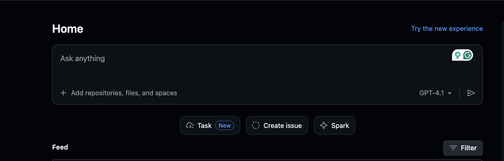
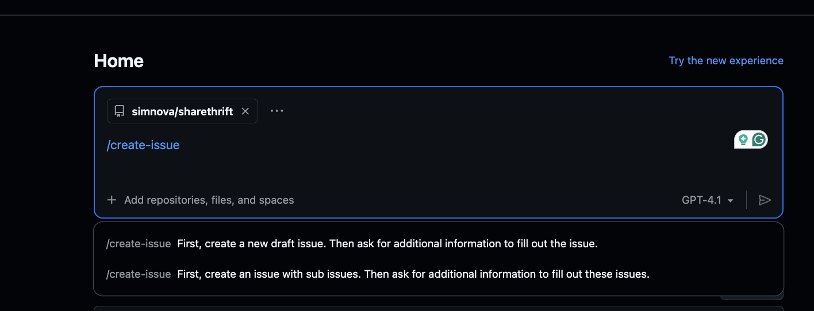
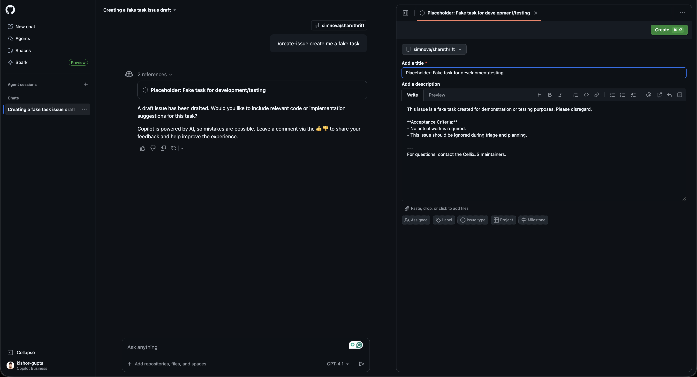

# Contributing to ShareThrift

Thank you for your interest in improving ShareThrift. This guide explains how to propose changes, create issues (including using GitHub Copilot’s coding agent), follow Domain-Driven Design (DDD) conventions, and get your pull requests reviewed and merged.

## Principles & Project Scope
ShareThrift promotes sustainable reuse via a peer‑to‑peer sharing platform. We prioritize:
- Clear business‑aligned domain models (aggregates, entities, value objects)
- Maintainable modular boundaries (bounded contexts)
- Event-driven evolution (domain & future integration events)
- Simplicity first; avoid premature generalization

## Ways to Contribute
- Report bugs & usability issues
- Propose enhancements (features, performance, observability, tooling)
- Improve domain model clarity & documentation
- Add tests (unit, integration, scenario/feature)
- Write or refine ADRs for architectural decisions
- Improve developer experience (scripts, tasks)

## Issue Creation Workflow (Copilot & Manual)
### Manual Issue
1. Click “New Issue” in the repository.
2. Use a clear title: `listing: implement pause/resume state`.
3. Provide context: brief description (business rationale, acceptance criteria).
4. Add labels: `domain`, `ui`, `tech-debt`, `documentation`, etc.
5. Assign yourself, copilot, or another contributor.

### Copilot-Assisted Issue
If you want the GitHub Copilot coding agent to implement the task:
1. Open GitHub → Copilot Home
2. Make sure your ShareThrift repository is added/selected at the top.
3. In the prompt/input box, describe the task you want Copilot to generate as an issue.
`/create-issue create an issue to implement pause/resume state machine for listings`
4. Copilot will generate a draft issue automatically.
5. Review the created draft:
    - Title
    - Description
    - Acceptance Criteria
    - Links (BRD/SRD/ADRs if applicable)
6. Edit the generated issue if needed (DO NOT skip reviewing).
7. Add labels: `domain`, `ui`, `tech-debt`, `documentation`, etc.
8. Assign yourself, copilot, or another contributor.







Copilot will attempt to open a Pull Request automatically. Monitor its progress, review the PR thoroughly, and request adjustments as needed.

If task assigned to the Copilot user. The agent will create a branch and PR (example: `copilot/issue-XYZ`).

## Pull Request Process & Review Guidelines
1. Branch from `main` using a descriptive name: `feature/listing-lifecycle`, `fix/messaging-timeout`.
2. Keep PRs focused; avoid mixing refactors with new features.
3. Ensure build succeeds: `pnpm run build`.
4. Ensure tests pass: `pnpm test` and maintain coverage.
5. Run lint/format: `pnpm run lint` (Biome).
6. Update or add ADRs for architectural changes.
7. Provide PR description:
   - Problem statement
   - Solution summary
   - Affected domain concepts
   - Testing evidence (screenshots/logs if UI/telemetry)
8. Request review from domain owners / maintainers.
9. Address comments promptly and explain trade‑offs when declining suggestions.
10. Squash commits if noisy or fixup commits exist; maintain clear history.

### Reviewers Check:
- Domain invariants upheld
- No leakage of infrastructure into domain layer
- Proper file naming & exports
- Adequate test coverage & meaningful assertions
- No unexplained new dependencies

## Naming & File Conventions
- Kebab-case for file & folder names: `listing-reservation.aggregate.ts`
- Aggregate root file ends with `.aggregate.ts`
- Entity file ends with `.entity.ts`
- Avoid one-letter variable names; prefer intention-revealing naming

## Testing & Quality Requirements
- Every aggregate, entity, value object: unit tests + scenario (`.feature`) files
- Use Vitest for tests; avoid broad integration unless required
- Assert domain invariants explicitly (not just property presence)
- Maintain or improve coverage; do not submit PRs that reduce quality gates

Example commands:
```bash
pnpm run build
pnpm test
pnpm run lint
```

## Documentation & ADRs
- Significant architectural shifts require an ADR (`apps/docs/` folder)
- Reference existing ADRs (DDD, telemetry, infra) when building upon patterns

## Dependencies & Technology Decisions
- Before adding a new dependency: evaluate footprint, security posture, maintenance status
- For domain logic: avoid infrastructure libraries directly
- Add dependency rationale in PR description or ADR if impactful

## Security & Vulnerability Reporting
- Do not include secrets in code or commits

## Contributor Resources
- README (architecture, roadmap)
- BRD/SRD: business and system requirements (`apps/docs/`)
- ADRs: architectural decision history

## Asking for Help
If you need any help while contributing, feel free to email maintainer (`pgidich@ecfmg.org`). We are more than happy to assist!

By contributing to ShareThrift, you agree to follow our Code of Conduct. → See [CODE_OF_CONDUCT.md](./CODE_OF_CONDUCT.md)

Thank you for your contributions! 👍