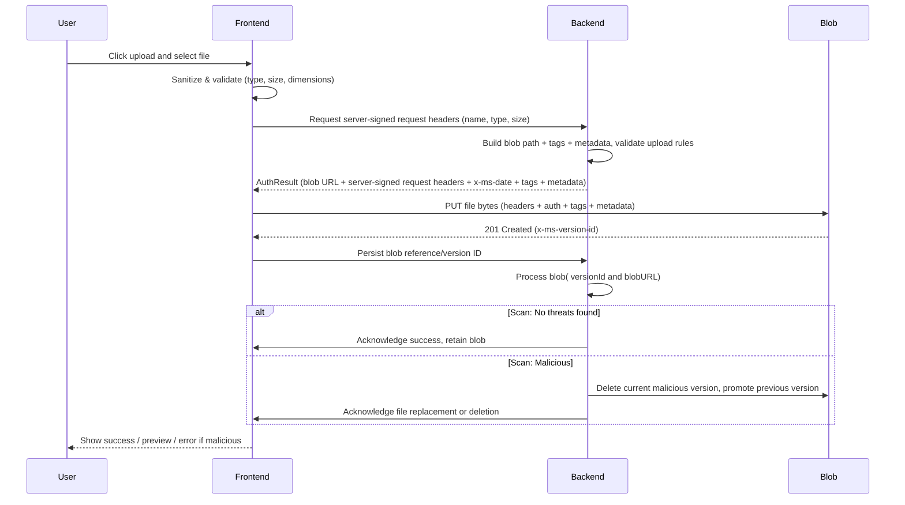

# Existing Azure Upload Implementation

## Context and Problem Statement

Our application requires a secure and scalable mechanism for handling file uploads. From the start, the design approach was to leverage Azure Blob Storage as the primary file storage service due to its reliability, scalability, and seamless integration with the Azure ecosystem.

Users need to upload various file types (PDFs, images) along with metadata and tags for tracking. The system implements a direct upload flow where the client requests authorization from the backend, which issues server-signed request headers (using Shared Key authorization) allowing the file to be uploaded directly to Azure Blob Storage.

## Decision Drivers

- **Scalability**: The system must efficiently handle large file uploads and multiple concurrent requests without overloading backend services.
- **Performance**: Direct client-to-Azure Blob uploads reduce backend latency and improve user upload speed.
- **Cost Optimization**: Offloading upload bandwidth from backend servers to Azure Blob Storage minimizes infrastructure and data transfer costs.
- **Security**: Uploads must be secure and authenticated. The Valet Key pattern provides controlled, time-bound access to the storage account.
- **Malware Scanning**: Uploaded files must undergo malware scanning. Any malicious files must be identified, quarantined, and deleted immediately to maintain data integrity and user safety.

## Considered Architectural Upload Options

- **Option 1: Backend-mediated uploads (server uploads to Blob Storage)**
    - The client uploads files to the backend, which then transfers them to Azure Blob Storage.

- **Option 2: Valet Key architectural pattern (direct client uploads) (current approach)**
    - Client requests permission from the backend; backend validates and grants time‑bound, scope‑limited permission for a specific upload; client uploads directly to Azure Blob Storage.
    - The Valet Key pattern is an architectural approach where the backend acts as a gatekeeper that grants narrowly scoped, time‑bound permission for a specific operation against storage. The client never has broad storage credentials and only performs the single intended operation within a short window using parameters the server defines (path, headers, metadata, tags, and expiry).

## Pros and Cons of the Options

### Backend-mediated uploads
- Good, because simpler client logic; backend can stream/transform data inline.
- Bad, because higher backend load and egress, potential bottlenecks, increased infrastructure cost.

### Valet Key architectural pattern
- Good, because excellent scalability, reduced backend bandwidth/cost, improved upload performance and latency, precise server control over per‑upload intent (path, metadata, tags).
- Bad, because validation and security checks occur after upload, adding complexity to post-upload workflows (e.g., malware scanning) and requiring careful orchestration of server-issued parameters and client behavior.

## Architectural Upload Decision Outcome

Chosen option: **Valet Key architectural pattern (direct client uploads) (current approach)**, because it offloads upload traffic from the backend, reduces latency, lowers cost, and maintains security.

## Considered Authorization Mechanism (within Valet Key)

- **Option 1: Short‑lived SAS token**
    - A short‑lived Shared Access Signature (SAS) is a token with a very limited validity period that grants specific permissions to access a blob or container. If such a token is intercepted, it can still be misused for the duration of its lifetime, so it must be kept extremely short and carefully managed.

- **Option 2: Shared Key authorization with server-signed request headers (current approach)**
    - The server signs the request using the storage account’s key (request signing). The client sends the exact signed headers as provided by the backend to perform the upload. This is not a token; it is a request authenticated via Shared Key authorization. It allows the client to perform a single, narrowly scoped upload operation using server-signed request headers, without exposing the account key, and the backend can control exactly which permissions, metadata, and expiry apply for each individual upload request.

### Pros/Cons

### Short‑lived SAS token
- Good, because it's simple client integration; permission and expiry embedded in a single token; easy link‑style distribution when appropriate.
- Bad, because token becomes a reusable artifact during its lifetime; needs strict expirations and storage discipline; leakage risk exists for the token window.

### Shared Key (current approach)
- Good, because no reusable token artifact; tighter server‑side control over the exact method, resource path, headers, metadata, tags, and narrow time window; matches current implementation.
- Bad, because backend must construct canonicalized request details; stronger coupling between backend‑issued headers and client upload code.

## Authorization Mechanism (within Valet Key) Decision Outcome

Chosen option: **Option 2: Shared Key authorization with server-signed request headers (current approach)**, because server-signed request headers are generated by the backend per request with the correct blob path, metadata, and tags, and are cryptographically signed so that clients or third parties cannot tamper with or escalate their permissions. Although Shared Key authorization does not include an explicit expiry field like SAS, request validity is effectively time-bounded by Azure Blob Storage through the x-ms-date header and strict clock-skew enforcement, with the backend issuing these signed headers just-in-time per upload.

### Why we did not choose SAS tokens

- **Insufficient granularity for headers/metadata/tags**: SAS scopes permissions (read/write/list/set permissions) and time, but it does not bind the request to specific header values like `x-ms-meta-*` or blob index tags. A SAS with `w` (write) or `c` (create) permission allows any actor possessing the token to upload any content and arbitrary metadata/tags to the scoped resource during the token lifetime.
- **Reusable artifact risk**: A leaked SAS can be used by unauthorized parties for the duration of its validity window. While short expirations help, they do not eliminate the risk of misuse within that window.
- **No content-level binding**: SAS does not bind the authorization to the server-approved payload (file digest, exact headers, or preapproved metadata/tags). With server-signed request headers, we include the precise headers the client must send; any deviation invalidates the signature.
- **Operational blast radius**: Using SAS for direct client uploads would require wide distribution of short-lived tokens and introduce complex token lifecycle management without improving our fine-grained control over what is uploaded.

We considered placing a proxy in front of uploads (client → Function App → Blob) to perform server-side validation with SAS or Entra ID, but this approach reintroduces backend bandwidth/latency bottlenecks and increases exposure to DDoS and malicious payload processing on the server. Our current design avoids those risks by keeping uploads direct while maintaining strong, per-request constraints through server-signed request headers.

### Why we have not switched to Entra ID (Azure AD)

- **Control model mismatch**: Entra ID enables RBAC and token-based auth for storage, and can mint user delegation SAS, but it does not provide the same mechanism to cryptographically bind uploads to exact header values, metadata, and tags for a single pre-authorized request. Our design relies on signing the canonical request (including headers) so the client cannot alter approved parameters.
- **Managed Identity does not expose account keys**: Shared Key authorization requires the storage account key to sign the canonical request. Managed Identity (MI) authenticates the Function App to Azure but does not grant access to the raw account key value. Without the account key, we cannot perform Shared Key authorization as implemented.
- **User delegation SAS still inherits SAS limitations**: Even with Entra ID, user delegation SAS remains a SAS model—time/permission scoped, but not bound to specific header values or content—and therefore lacks our required fine-grained constraints.

We prefer Entra ID for service-to-service auth wherever possible and continue to revisit it. For uploads requiring per-request binding to exact headers/metadata/tags, Shared Key authorization remains the only option that satisfies our constraints.

### Mitigations for storage account key exposure

Although Shared Key authorization requires access to the storage account key, the associated risk is mitigated through the following controls:

- **Key Vault only, no inline secrets**: The storage account key is never stored in code or configuration. It resides solely in Azure Key Vault.
- **Access via Managed Identity**: The Function App accesses the Key Vault using its Managed Identity, with least-privilege RBAC and no direct exposure of the key outside the process memory of the signing operation.
- **Network and access controls**: Key Vault firewall, private endpoints, and access policies restrict retrieval to the Function App identity. Storage account network rules further limit access.
- **Key rotation**: Regular rotation of storage account keys reduces exposure window if compromise were ever to occur.
- **Monitoring and scanning**: Defender for Storage malware scanning, audit logs, and alerts monitor anomalous activity; malicious uploads are quarantined and rolled back using blob versioning.
- **Time-bounded signed requests**: Each upload is signed just-in-time with strict `x-ms-date` constraints; signatures expire quickly and cannot be reused or altered by clients.

## Consequences

- Good, because uploading directly from the client to Azure Blob Storage using Shared Key significantly reduces backend bandwidth usage and infrastructure costs.
- Good, because versioning support allows easy rollback in case of corruption or malicious file detection.
- Bad, because malware scanning occurs after upload, introducing a brief exposure window before a file is fully validated.

## Implementation Details

**Frontend Components:**
- Handles client-side file validation (type, size, dimensions).
- Requests authorization from the backend to upload a specific file.
- Uses the server-provided server-signed request headers to upload the file directly to Azure Blob Storage.
- After upload, notifies the backend to trigger malware scanning and persist upload metadata.

**Backend Services:**
- Server-signed request headers generation:
    - The backend handles server-signed request headers generation and validation for Azure Blob Storage uploads, ensuring secure and controlled access for file uploads. There are different mutations for PDF and image files. The backend service encapsulates all business logic enforcing file upload restrictions and security requirements before enabling clients to upload files directly to Azure Blob Storage using carefully permissioned, server-signed request headers. 
- Post-Upload Malware Handling:
    - The backend polls the blob for the Microsoft Defender for Storage scan result tag: `No threats found` or `Malicious`.
        - `No threats found` → retain the blob.
        - `Malicious` → delete the current blob version and restore the previous non-malicious version.
            - The previous version is promoted to current using copyBlob.
            - Current malicious version is deleted, optionally using permanentlyDeleteBlobVersion if supported.

- Versioning & Recovery 
    - Blob versioning is enforced to support rollback.
    - Previous non-malicious versions are retained and promoted if a malicious file is detected.

**Sequence Diagram**

## Technical Considerations and Known Limitations

- Malware scanning occurs after upload using Azure Blob Storage’s capabilities. Files flagged as malicious are deleted or reverted to ensure data integrity. The system uses Microsoft Defender for Storage to automatically scan uploaded blobs for malware. Defender checks for known malware signatures, embedded scripts, and other suspicious file patterns. This introduces a small window where a malicious file may exist in storage before removal.
- At present, backend permission enforcement for blob upload is minimal. The frontend restricts upload actions according to application state, but users could potentially bypass this if they possess valid credentials.
- Future improvements will focus on implementing domain-driven permission checks before upload authorizations/server-signed request headers are issued.