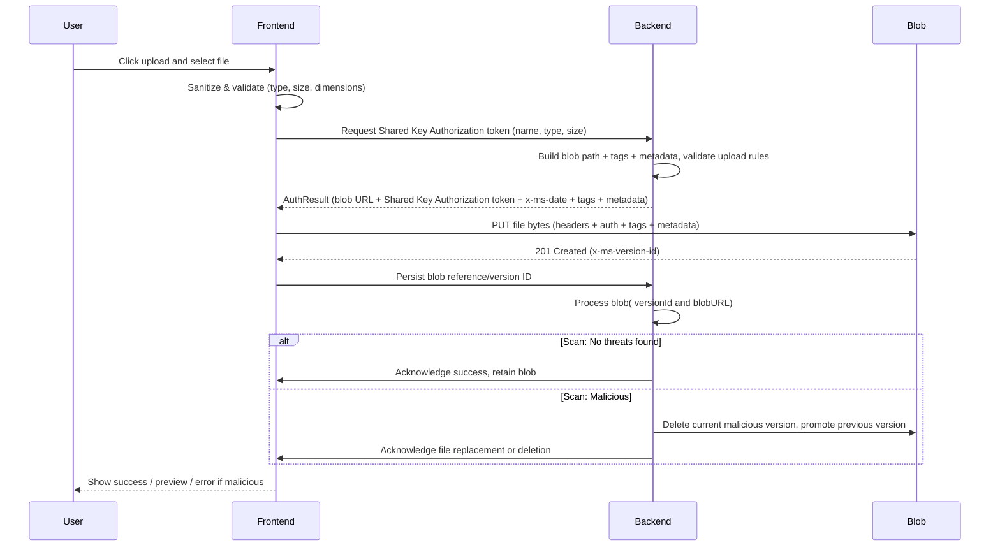

# Existing Azure Upload Implementation

## Context and Problem Statement

Our application requires a secure and scalable mechanism for handling file uploads. From the start, the design approach was to leverage Azure Blob Storage as the primary file storage service due to its reliability, scalability, and seamless integration with the Azure ecosystem.

Users need to upload various file types (PDFs, images) along with metadata and tags for tracking. The system implements a direct upload flow where the client requests authorization from the backend, which issues a Shared Key Authorization token allowing the file to be uploaded directly to Azure Blob Storage.

## Decision Drivers

- **Scalability**: The system must efficiently handle large file uploads and multiple concurrent requests without overloading backend services.
- **Performance**: Direct client-to-Azure Blob uploads reduce backend latency and improve user upload speed.
- **Cost Optimization**: Offloading upload bandwidth from backend servers to Azure Blob Storage minimizes infrastructure and data transfer costs.
- **Security**: Uploads must be secure and authenticated. The Valet Key pattern provides controlled, time-bound access to the storage account.
- **Malware Scanning**: Uploaded files must undergo malware scanning. Any malicious files must be identified, quarantined, and deleted immediately to maintain data integrity and user safety.

## Considered Authorization Options

- **Option 1: Short‑lived SAS tokens**
    - A short‑lived Shared Access Signature (SAS) is a token with a very limited validity period that grants specific permissions to access a blob or container. If such a token is intercepted, it can still be misused for the duration of its lifetime, so it must be kept extremely short and carefully managed.

- **Option 2: Valet Key pattern (current approach)**
    - A Valet Key pattern (Shared Key Authorization) is a time‑limited, permission‑scoped URL generated using the storage account’s access key. It allows the client to upload or modify blobs temporarily without exposing the actual account key, and the backend can control exactly which permissions, metadata, and expiry apply for each individual upload request.
       
    

## Authorization Decision Outcome

Chosen option: **Option 2: Valet Key pattern (current approach)**, because Shared Key Authorization tokens are generated by the backend per request with the correct blob path, metadata, and tags, and are cryptographically signed so that clients or third parties cannot tamper with or escalate their permissions.

## Considered Upload Options

- **Option 1: Backend-mediated uploads (server uploads to Blob Storage)**
    - The client uploads files to the backend, which then transfers them to Azure Blob Storage.

- **Option 2: Direct client uploads using Azure Blob Valet Key pattern (Shared Key Authorization) tokens (current approach)**
    - The backend generates a Shared Key Authorization token authorizing the client to upload directly to Blob Storage.

## Uploads Decision Outcome

Chosen option: **Option 2: Direct client uploads using Azure Valet Key pattern (Shared Key Authorization) tokens (current approach)**, because it offloads upload traffic from the backend, reduces latency, lowers cost, and maintains security via Shared Key tokens.

## Consequences

- Good, because uploading directly from the client to Azure Blob Storage significantly reduces backend bandwidth usage and infrastructure costs.
- Good, because versioning support allows easy rollback in case of corruption or malicious file detection.
- Bad, because malware scanning occurs after upload, introducing a brief exposure window before a file is fully validated.

## Implementation Details

**Frontend Components:**
- Handles client-side file validation (type, size, dimensions).
- Requests authorization from the backend to upload a specific file.
- Uses the received Shared Key Authorization token to upload the file directly to Azure Blob Storage.
- After upload, notifies the backend to trigger malware scanning and persist upload metadata.

**Backend Services:**
- Shared Key Authorization Token Generation:
    - The backend handles Shared Key Authorization token generation and validation for Azure Blob Storage uploads, ensuring secure and controlled access for file uploads. There are different mutations for PDF and image files. The backend service encapsulates all business logic enforcing file upload restrictions and security requirements before enabling clients to upload files directly to Azure Blob Storage using carefully permissioned, Shared Key–signed Authorization tokens. 
- Post-Upload Malware Handling:
    - The backend polls the blob for the Microsoft Defender for Cloud scan result tag: `No threats found` or `Malicious`.
        - `No threats found` → retain the blob.
        - `Malicious` → delete the current blob version and restore the previous non-malicious version.
            - The previous version is promoted to current using copyBlob.
            - Current malicious version is deleted, optionally using permanentlyDeleteBlobVersion if supported.

- Versioning & Recovery 
    - Blob versioning is enforced to support rollback.
    - Previous non-malicious versions are retained and promoted if a malicious file is detected.

**Sequence Diagram**

## Technical Considerations and Known Limitations

- Malware scanning occurs after upload using Azure Blob Storage’s capabilities. Files flagged as malicious are deleted or reverted to ensure data integrity. The system uses Microsoft Defender for Storage to automatically scan uploaded blobs for malware. Defender checks for known malware signatures, embedded scripts, and other suspicious file patterns. This introduces a small window where a malicious file may exist in storage before removal.
- At present, backend permission enforcement for blob upload is minimal. The frontend restricts upload actions according to application state, but users could potentially bypass this if they possess valid credentials.
- Future improvements will focus on implementing domain-driven permission checks before Shared Key Authauthorization tokens are issued and exploring pre-upload scanning alternatives to further reduce risk.