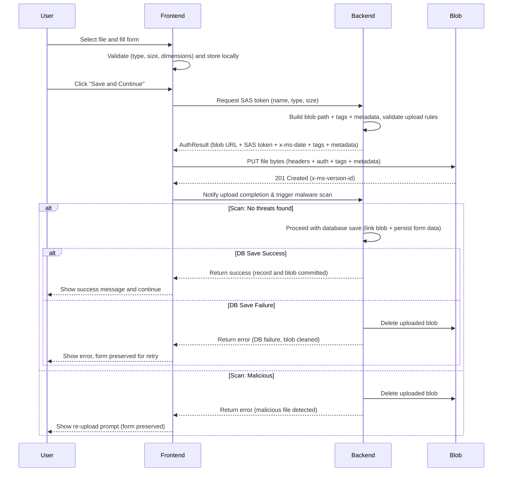

# New Azure Upload Flow

## Context and Problem Statement

In the previous implementation, files selected by users were uploaded immediately to Azure Blob Storage using a short-lived SAS token, before the user confirmed saving their form. While this offered quick feedback, it often resulted in orphaned files that were never referenced by a saved record, leading to potential storage bloat, premature file exposure, and inconsistent application state.

To resolve this, we need a flow where upload and database commit are strictly linked: files are uploaded and scanned only after the user clicks "Save," ensuring every accepted blob is both safe and linked to a committed database row. Any failed step triggers cleanup and instant user feedback.

## Decision Drivers

- **Data Integrity**: Ensure only confirmed user actions create stored files.
- **Cost Efficiency**: Prevent accumulation of unreferenced or orphaned blobs in storage.
- **User Experience**: Keep upload responsiveness while reducing accidental uploads.
- **Security and Compliance**: Limit storage exposure by avoiding unnecessary data persistence.
- **Maintainability**: Simplify cleanup and lifecycle management by aligning uploads with committed user actions.

## Considered Options

- **Option 1: Immediate upload on file select (current approach)**
  - Uploads start as soon as the user selects a file.
  - Backend issues SAS token and file is persisted to Azure instantly.
  - Blob may exist without ever being referenced or committed by the application.

- **Option 2: Deferred upload triggered by user confirmation. Transactional Upload + Scan + Save (proposed)**
  - User selects file(s) and enters form data; files are held locally, nothing is uploaded yet.
  - On **Save/Continue** the backend generates a SAS token and the frontend uploads the file.
  - **Malware scan** runs immediately after upload.
  - If the file passes, backend commits the database record and links the blob.
  - If scan fails, save is aborted, the blob is deleted, and the user is alerted to retry.
  - If save fails, the uploaded blob is deleted right away to prevent orphans.

## Decision Outcome

Chosen option: **Option 2: Deferred upload triggered by user confirmation. Transactional Upload + Scan + Save.**  
Upload, scan, and save now execute as a single atomic workflow.  
No data is finalized unless every stage succeeds. Cleanup and user feedback happen immediately on failure.

## Consequences

- **Positive:**
  - Orphaned and unreferenced files are eliminated.
  - Ensures consistent and secure linkage between uploaded blobs and saved data.
  - Regulatory and operational risks are minimized.
  - No background sweeps or delayed cleanups required.

- **Negative:**
  - Upload initiation is delayed until user confirmation, possibly increasing total save time.
  - Slightly more complex frontend logic to manage pending uploads and confirmation triggers.
  - Require a local memory/state variable to store the file until the final save.

## Implementation Details

**Sequence Diagram**

## Technical Considerations

- The entire operation — upload, malware scan, and database save — functions as a single logical transaction. If any step fails, the process is rolled back, and no partial or orphaned data remains in the system.
- If a database transaction fails after a successful scan and blob upload, the backend immediately deletes the blob version to maintain consistency between the database and storage. Similarly, failed or malicious uploads never reach the committed state, ensuring there are no unreferenced blobs.
- The frontend will temporarily hold selected files in memory or a local object store until “Save and Continue” is clicked.
- The backend will continue to issue SAS tokens on-demand but only after the confirmation action.
- Cleanup will no longer be required for abandoned uploads, as no file is stored remotely without user confirmation.

---
