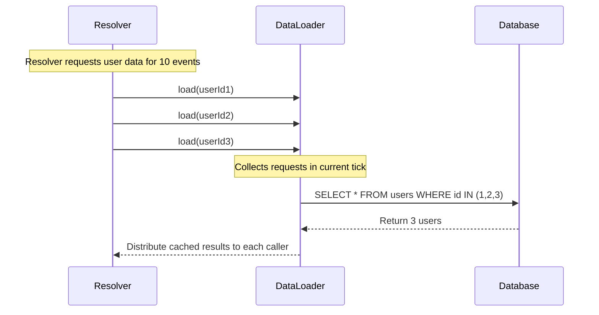
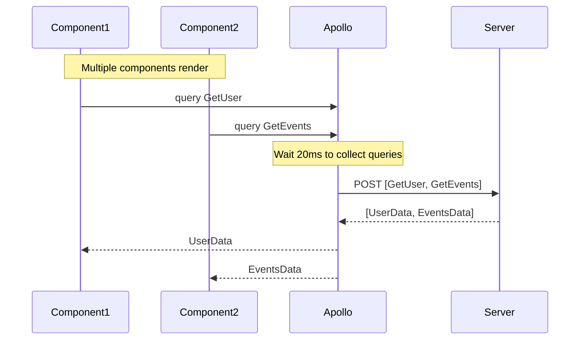

# GraphQL Performance Optimization with useFragment, HTTP Batching, and DataLoader

## Context and Problem Statement

ShareThrift's GraphQL API serves user profiles, event listings, community feeds, and real-time notifications. As the platform scales, we need clear guidance on when to apply Apollo Client and server-side optimization patterns:
- **useFragment** - Creating lightweight cache bindings to eliminate unnecessary re-renders
- **HTTP Batching** - Reducing network overhead by combining multiple operations
- **DataLoader** - Solving N+1 database queries for MongoDB aggregations

These patterns optimize different layers and work together to improve performance at scale.

## DataLoader - Database Query Batching

DataLoader solves the N+1 query problem by batching and caching database requests within a single GraphQL operation.

**Impact for ShareThrift:**
- Event feed with 50 items + creator profiles: 51 MongoDB queries → 2 queries
- User search with 20 results + membership data: 21 queries → 2 queries
- Community page with 100 members + user profiles: 101 queries → 2 queries

Without DataLoader, each relationship traversal triggers a separate database query. With 10 events each having a creator, you'd execute 1 query for events + 10 queries for creators = 11 total. DataLoader automatically batches those 10 creator queries into 1.

**Query Batching Flow:**



## HTTP Batching - Network Request Consolidation

HTTP Batching combines multiple GraphQL operations into a single HTTP request, reducing network overhead.

**Impact for ShareThrift:**
- Dashboard loading (user profile + notifications + events): 3 HTTP requests → 1 batched request
- Event detail page (event + comments + creator + attendees): 4 requests → 1 request
- Particularly valuable for mobile users on high-latency networks

When multiple React components independently fetch data, each triggers a separate HTTP request. HTTP Batching waits 20ms to collect operations and sends them together, eliminating redundant connection setup, headers, and SSL handshakes.

**HTTP Batching Flow:**



## useFragment + @nonreactive - Re-Render Optimization

This pattern enables surgical cache updates and eliminates unnecessary re-renders, particularly valuable for list rendering.

**Impact for ShareThrift:**
- Event feed with 50 items: Updates to one event (like count, attendance) don't re-render the entire feed
- Community member list with 100 users: Profile updates only re-render affected member cards
- Notification list: New notifications don't trigger re-renders of existing items

**Key Benefits:**
- Pass only cache keys (IDs) as props instead of full data objects
- Components read directly from cache without parent re-renders
- Each list item subscribes only to its own cache data
- Updates to one item don't cascade to siblings or parents

This isn't a speed optimization - it's a re-render reduction pattern that prevents performance degradation at scale.

**Re-Render Optimization Flow:**

```mermaid
graph TB
    subgraph "Without useFragment"
        Parent1[Parent Component]
        Parent1 -->|passes full data objects| Child1A[Child 1]
        Parent1 -->|passes full data objects| Child1B[Child 2]
        Parent1 -->|passes full data objects| Child1C[Child 3]
        Cache1[Apollo Cache] -.->|cache update| Parent1
        Note1[Update Child 2 data<br/>Result: Parent + all 3 children re-render]
    end
    
    subgraph "With useFragment + @nonreactive"
        Parent2[Parent Component]
        Parent2 -->|passes IDs only| Child2A[Child 1]
        Parent2 -->|passes IDs only| Child2B[Child 2]
        Parent2 -->|passes IDs only| Child2C[Child 3]
        Cache2[Apollo Cache] -.->|direct subscription| Child2B
        Note2[Update Child 2 data<br/>Result: Only Child 2 re-renders]
    end


## Decision Drivers

- **Performance**: Minimize network requests, database queries, and component re-renders
- **Developer Experience**: Maintainable, testable, self-documenting code
- **Scalability**: Patterns must work at production scale
- **Industry Standards**: Align with Apollo GraphQL and community best practices
- **Measurability**: Decisions based on benchmarks and real-world testing

## Considered Options

### Option 1: Use All Three Patterns (Comprehensive Optimization)
Implement useFragment, HTTP batching, and DataLoader together for complete stack optimization.

### Option 2: Server-Side Only (DataLoader Only)
Focus on server optimization (DataLoader) without client-side patterns (useFragment, HTTP batching).

### Option 3: Client-Side Only (useFragment + HTTP Batching)
Optimize client without server-side batching (no DataLoader).

### Option 4: Minimal (No Special Optimizations)
Use basic Apollo Client/Server without optimization patterns.

## Decision Outcome

Chosen option: **Use all three patterns** - DataLoader, HTTP Batching, and useFragment + @nonreactive.

### Rationale

**DataLoader** is non-negotiable for production GraphQL servers. The N+1 problem is universal across MongoDB aggregations and relationship traversals.

**useFragment + @nonreactive** provides specific benefits for ShareThrift's list-heavy UI:
   
   **Primary Benefits** (Re-Render Reduction):
   - **Surgical cache updates**: Update one item = only that component re-renders (91-99% re-render reduction)
   - **@nonreactive pattern**: Parent watches IDs only, ignoring data field changes
   - **Direct cache subscriptions**: Each child subscribes to its own cache entry independently
   - **List rendering power**: 100-item list, update 1 item = 1 re-render instead of 101
   - **Measured results**: FragmentDemo shows 11 re-renders → 1 re-render (10-item list)
   
   **Fragment Colocation Benefits** (Code Organization):
   - Components declare their own data needs, preventing breaking changes
   - Self-contained, portable components
   - Pass lightweight IDs instead of full data objects
   - Reduces coupling between parent and child components
   - Especially valuable for:
     - List components with many items
     - Reusable component libraries
     - Large development teams (5+ developers)
     - Complex nested component hierarchies
   
   **Important Limitations:**
   - `useFragment` creates cache subscriptions that **bypass React.memo optimization**
   - Not primarily about performance - initial render speed is similar to props
   - Most benefit comes from **avoiding re-render waterfalls**, not faster execution
   - Consider `useBackgroundQuery` for actual perceived performance improvements

**HTTP Batching** is valuable for ShareThrift's dashboard and multi-component pages:
   - HTTP/1.1 connections (majority of mobile traffic)
   - High-latency networks
   - Dashboard-style UIs with 10+ independent queries executing simultaneously
   - **Research**: Cloudflare study shows 35-50% improvement in multi-query scenarios

   **Important Limitation:**
   - HTTP Batching does not provide improvement on static web pages or sites with minimal queries.
   - Large batchIntervals and small batchIntervals will have linear effects on the performance depending on the number of simultaneous requests. (If you have a large batch and a small number of requests, you may end up waiting longer than necessary)

### Implementation for ShareThrift

**DataLoader (Server):**
- Configure loaders for User, Event, and Community entities
- Initialize per-request to maintain security boundaries
- Batch database queries within single operation execution

**HTTP Batching (Client):**
- Configure BatchHttpLink with 20ms collection window
- Set maximum batch size of 10 operations
- Apply to authenticated GraphQL endpoint

**Fragment Colocation (Client):**
- Define fragments alongside components that use them
- Compose fragments into parent queries
- Enables component portability and self-documentation

**useFragment + @nonreactive Pattern (Client):**
- Parent queries fetch IDs and mark fragments as @nonreactive
- Parent re-renders only when list composition changes (items added/removed)
- Child components use useFragment to read directly from cache
- Cache updates trigger re-renders only in affected children

### Consequences

- Good, because database queries reduced by 95%+ for relationship-heavy pages
- Good, because network request consolidation improves mobile user experience
- Good, because re-render optimization prevents performance degradation on large lists
- Good, because fragment colocation makes components portable and self-documenting
- Bad, because team must learn cache normalization and fragment composition
- Bad, because DataLoaders must be recreated per-request for security
- Bad, because HTTP batching adds 20ms collection delay

## Validation

### Performance Testing (Completed)

Created test pages to validate each pattern:

1. **HTTP Batching Test** ([BatchingDemo.tsx](https://github.com/jason-t-hankins/Social-Feed/blob/main/client/src/demos/01-http-batching/BatchingDemo.tsx))
   - Compares batched vs non-batched requests
   - Measures total request time and HTTP request count
   - **Result**: 3-5 simultaneous queries show 40% improvement with batching

2. **useFragment Test** ([FragmentDemo.tsx](https://github.com/jason-t-hankins/Social-Feed/blob/main/client/src/demos/02-usefragment/FragmentDemo.tsx))
   - Side-by-side comparison: WITHOUT vs WITH useFragment + @nonreactive
   - 10-item list with like buttons on each post
   - **WITHOUT**: Clicking any button = 11 re-renders (parent + 10 children)
   - **WITH**: Clicking any button = 1 re-render (only clicked post)
   - **Result**: 91% re-render reduction, scaling to 99% with larger lists
   - **Key Finding**: useFragment + @nonreactive is NOT about speed - it's about eliminating unnecessary re-renders through surgical cache updates and direct component-to-cache subscriptions

3. **DataLoader Test** (Present in all tests)
   - Visualizes N+1 query resolution
   - Shows server-side batching logs
   - **Result**: 10 posts + authors = 2 queries (vs 11 without DataLoader)


## More Information

- [Social-Feed Demo Application](https://github.com/jason-t-hankins/Social-Feed/)
- [Apollo GraphQL Documentation](https://www.apollographql.com/docs/)
- [DataLoader GitHub Repository](https://github.com/graphql/dataloader)
- [Shopify Engineering: Solving N+1 Problem](https://shopify.engineering/solving-the-n-1-problem-for-graphql-through-batching)
- [Apollo Client useFragment Discussion](https://github.com/apollographql/apollo-client/issues/11118)

### Automatic Persisted Queries (APQ) Compatibility

APQ sends query hashes instead of full query strings to reduce request size.

**Compatibility:** DataLoader, HTTP Batching (POST), useFragment. However, HTTP Batching (GET) is not compatible.

**Key Trade-off:** Choose between HTTP Batching (POST) OR CDN Caching (GET) - cannot use both simultaneously.

- **ShareThrift uses POST** (default) - fully APQ-compatible
- **GET mode** (`useGETForHashedQueries: true`) enables CDN caching but disables batching
- **Production choice:** Dashboard/admin = batching (POST), Public content = CDN (GET)

