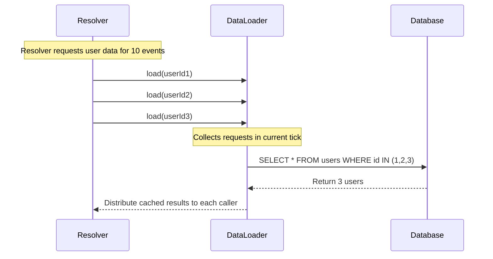
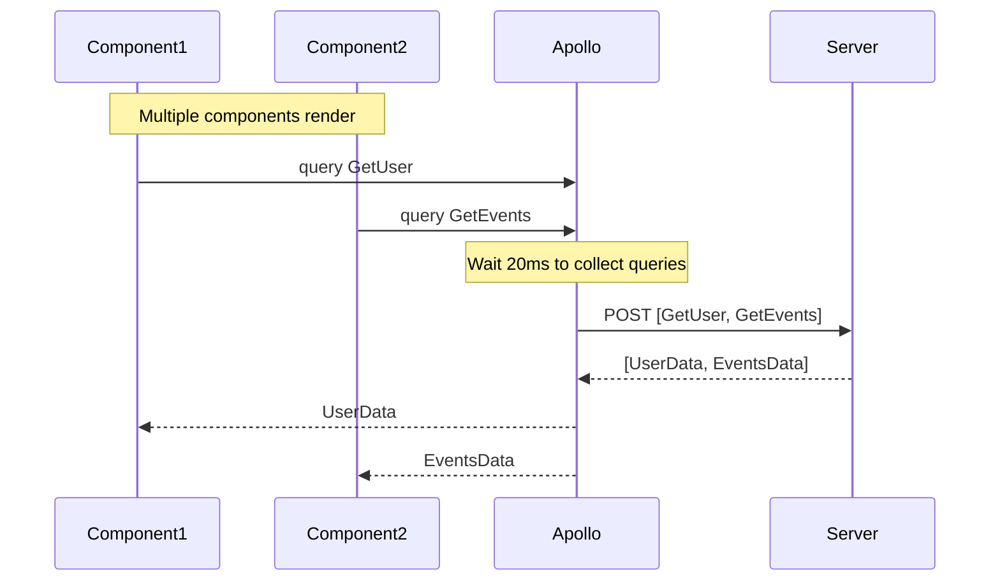
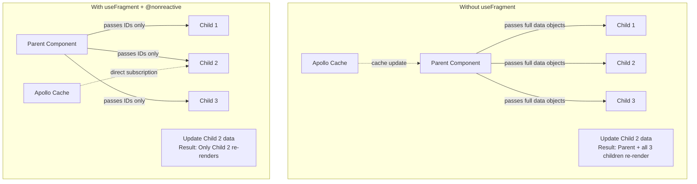

# GraphQL Performance Optimization with useFragment, HTTP Batching, and DataLoader

## Context and Problem Statement

ShareThrift's GraphQL API serves a variety of different component data. As the platform scales, we need clear guidance on when to apply Apollo Client and server-side optimization patterns:
- **useFragment** - Creating lightweight cache bindings to eliminate unnecessary re-renders
- **HTTP Batching** - Reducing network overhead by combining multiple operations
- **DataLoader** - Solving N+1 database queries for MongoDB aggregations

These patterns optimize different layers and work together to improve performance at scale.

## Decision Drivers

- **Performance**: Minimize network requests, database queries, and component re-renders
- **Developer Experience**: Maintainable, testable, self-documenting code
- **Scalability**: Patterns must work at production scale
- **Industry Standards**: Align with Apollo GraphQL and community best practices
- **Measurability**: Decisions based on benchmarks and real-world testing

## Considered Options

### Option 1: Use All Three Patterns (Comprehensive Optimization)
Implement useFragment, HTTP batching, and DataLoader together for complete stack optimization.

**DataLoader (Server-Side):**
- Solves N+1 query problem by batching database requests within a single GraphQL operation
- Event feed with 50 items + creator profiles: 51 MongoDB queries → 2 queries
- User search with 20 results + membership data: 21 queries → 2 queries
- Automatically batches relationship traversals (10 events with creators: 11 queries → 2 queries)

**HTTP Batching (Client-Side Network):**
- Combines multiple GraphQL operations into single HTTP request
- Dashboard loading (profile + notifications + events): 3 HTTP requests → 1 batched request
- Waits 20ms to collect operations, eliminating redundant connection setup and SSL handshakes
- Particularly valuable for HTTP/1.1 connections and high-latency mobile networks

**useFragment + @nonreactive (Client-Side Re-Renders):**
- Enables surgical cache updates that eliminate unnecessary re-renders in list rendering
- Event feed with 50 items: Update one event = 1 re-render instead of 51
- Components receive IDs only and read directly from cache via independent subscriptions
- Measured results: 91-99% re-render reduction for list components

### Option 2: Server-Side Only (DataLoader Only)
Focus on server optimization (DataLoader) without client-side patterns (useFragment, HTTP batching).
- Eliminates N+1 database queries but doesn't optimize network or client rendering
- Multiple component queries still trigger separate HTTP requests
- List updates still cause parent + all children to re-render

### Option 3: Client-Side Only (useFragment + HTTP Batching)
Optimize client without server-side batching (no DataLoader).
- Reduces network overhead and re-renders but doesn't solve N+1 database problem
- Server still executes excessive database queries for relationship traversals
- Database becomes performance bottleneck under load

### Option 4: Minimal (No Special Optimizations)
Use basic Apollo Client/Server without optimization patterns.
- Simplest implementation with no learning curve
- Suffers from N+1 queries, excessive HTTP requests, and re-render cascades
- Not viable for production scale with list-heavy UIs

## Decision Outcome

Chosen option: **Use all three patterns** - DataLoader, HTTP Batching, and useFragment + @nonreactive.

DataLoader is non-negotiable for production GraphQL servers as the N+1 problem is universal across MongoDB aggregations and relationship traversals, delivering 95%+ reduction in database queries for relationship-heavy pages. useFragment + @nonreactive provides 91-99% re-render reduction through surgical cache updates where list item updates trigger only 1 re-render instead of parent + all siblings. HTTP Batching consolidates multiple component queries into single requests for dashboard-style UIs where multiple components independently fetch data, reducing 3-4 HTTP requests to a single batched request and eliminating redundant connection overhead - particularly valuable for ShareThrift's mobile users on high-latency networks where Cloudflare research shows 35-50% improvement in multi-query scenarios.

## Technical Considerations

- DataLoader batching occurs within a single GraphQL operation execution tick, collecting all load calls before issuing a single database query with an IN clause
- HTTP Batching waits 20ms to collect operations from multiple components before sending a single POST request with an array of operations
- useFragment creates direct cache subscriptions that bypass parent component re-renders, enabling list items to update independently. Unlike useState + useEffect patterns that require manual dependency tracking and effect callbacks, useFragment establishes an automatic reactive subscription to the Apollo Cache - when the cached entity changes, the component automatically re-renders with updated data without any explicit effect setup. The `complete` flag indicates whether all requested fragment fields are available in cache, and the subscription persists for the component's lifetime, similar to how a computed value automatically updates when its dependencies change
- Fragment colocation allows components to declare their own data requirements, making them portable and preventing breaking changes when moving components
- ShareThrift uses POST requests for authenticated endpoints (compatible with HTTP Batching) and reserves GET requests with APQ for public CDN-cached endpoints
- BatchHttpLink configured with batchMax of 10 operations and batchInterval of 20ms balances latency with batching efficiency
- DataLoaders must be instantiated per-request in GraphQL context to prevent cross-request data leakage between users

### Automatic Persisted Queries (APQ) Compatibility

APQ sends query hashes instead of full query strings to reduce request size. DataLoader, HTTP Batching (POST), useFragment are compatible with APQ. However, HTTP Batching (GET) is not compatible.Must choose between HTTP Batching (POST) OR CDN Caching (GET) - cannot use both simultaneously. **GET mode** (`useGETForHashedQueries: true`)

### Fragment Colocation vs Container Pattern

Fragment colocation places data requirements directly in components alongside their rendering logic, enabling components to declare their own data needs and remain portable across the application. This contrasts with the container pattern where parent components fetch all data and pass it down as props, creating tight coupling and fragile dependencies. Components using fragment colocation can be moved, reused in component libraries, or modified without breaking parent queries - particularly valuable for large development teams (5+ developers) working on list-heavy UIs and complex nested component hierarchies where passing IDs instead of full data objects reduces coupling and prevents breaking changes.

## Consequences

- Good: database queries reduced by 95%+ for relationship-heavy pages
- Good: network request consolidation improves mobile user experience
- Good: re-render optimization prevents performance degradation on large lists
- Good: fragment colocation makes components portable and self-documenting
- Bad: team must learn cache normalization and fragment composition
- Bad: DataLoaders must be recreated per-request for security
- Bad: HTTP batching adds 20ms collection delay

## Implementation Details

### DataLoader Query Batching Flow

### HTTP Batching Request Consolidation Flow

### useFragment Re-Render Optimization Flow

## Validation with Performance Testing

Created test pages to validate each pattern:

1. **HTTP Batching Test** ([BatchingDemo.tsx](https://github.com/jason-t-hankins/Social-Feed/blob/main/client/src/demos/01-http-batching/BatchingDemo.tsx))
   - Compares batched vs non-batched requests
   - Measures total request time and HTTP request count
   - **Result**: 3-5 simultaneous queries show 40% performance improvement with batching

2. **useFragment Test** ([FragmentDemo.tsx](https://github.com/jason-t-hankins/Social-Feed/blob/main/client/src/demos/02-usefragment/FragmentDemo.tsx))
   - 10-item list with like buttons on each post
   - **WITHOUT**: Clicking any button = 11 re-renders (parent + 10 children)
   - **WITH**: Clicking any button = 1 re-render (only clicked post)
   - **Result**: 91% re-render reduction, scaling to 99% with larger lists

3. **DataLoader Test** ([ApproachComparison.tsx](https://github.com/jason-t-hankins/Social-Feed/blob/main/client/src/demos/06-full-comparison/ApproachComparison.tsx))
   - Visualizes N+1 query resolution
   - Shows server-side batching logs
   - **Result**: 10 posts + authors = 2 queries (vs 11 without DataLoader)

## More Information

- [Social-Feed Demo Application](https://github.com/jason-t-hankins/Social-Feed/)
- [Apollo GraphQL Documentation](https://www.apollographql.com/docs/)
- [DataLoader GitHub Repository](https://github.com/graphql/dataloader)
- [Shopify Engineering: Solving N+1 Problem](https://shopify.engineering/solving-the-n-1-problem-for-graphql-through-batching)
- [Apollo Client useFragment Discussion](https://github.com/apollographql/apollo-client/issues/11118)