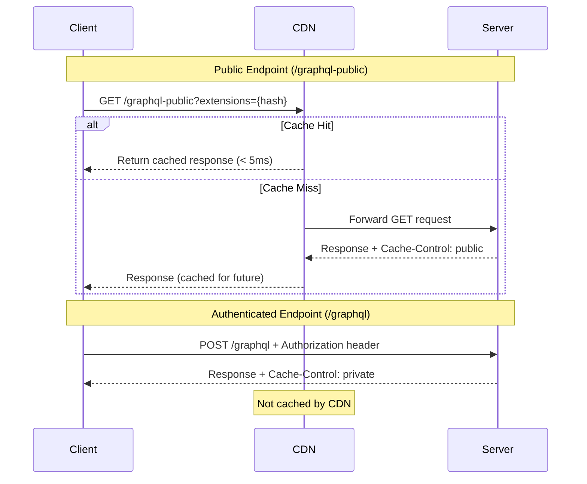

# Public GraphQL Caching for CDN and Network Providers

## Context and Problem Statement

ShareThrift serves both authenticated users (managing events, communities, memberships) and unauthenticated visitors (browsing public event listings, viewing community pages). Public content could benefit from CDN caching (Cloudflare, Fastly) and network provider caching, but GraphQL's default behavior creates challenges:

1. JWT tokens in requests prevent public caching
2. POST requests aren't cached by CDNs by default
3. Full query strings increase bandwidth consumption
4. Risk of accidentally caching authenticated data and exposing sensitive information

We need guidance for enabling public caching of unauthenticated queries while maintaining security.

## Decision Drivers

- **Security**: Prevent JWT token leakage and accidental caching of sensitive data
- **Performance**: Reduce server load and improve response times for public content
- **Compatibility**: Work with existing GraphQL tooling (Apollo Client/Server)
- **Maintainability**: Clear separation between public and private queries
- **Measurability**: Validate caching effectiveness through monitoring

## Considered Options

### Option 1: Separate Endpoints (Public + Authenticated)

Create two distinct GraphQL endpoints with physical separation:
- `/graphql` - Authenticated endpoint with POST requests, JWT tokens, HTTP batching, private cache headers
- `/graphql-public` - Public endpoint with GET requests, APQ, CDN-friendly cache headers (5min browser, 1hr CDN)

**Benefits:**
- Physical endpoint separation eliminates token leakage risk
- Public endpoint optimized for CDN caching with GET + APQ (80-95% cache hit rate, 97% faster responses)
- Authenticated endpoint optimized for HTTP batching and DataLoader
- Clear audit trail and impossible to accidentally cache authenticated requests

**Trade-offs:**
- Two Apollo Client instances to maintain
- Must categorize queries as public vs private
- GET requests cannot be batched (choose batching OR caching)

### Option 2: Same Endpoint with Conditional Auth

Use single `/graphql` endpoint with conditional authentication based on operation name:
- Client maintains whitelist of operations requiring authentication
- Context link checks operation name before adding auth header
- Public queries send custom header to signal caching eligibility
- Server dynamically sets cache policy based on header

**Benefits:**
- Single Apollo Client instance
- Single endpoint to manage
- No query duplication

**Trade-offs:**
- Security risk: Misconfigured whitelist could expose tokens to CDN
- Maintenance burden: Must keep operation whitelist synchronized
- Audit complexity: Harder to track which queries are public
- Testing overhead: More edge cases to validate

### Option 3: No Public Caching

Continue with current approach - all queries authenticated, no public caching:
- Single endpoint, all requests require JWT
- POST requests only
- Server handles 100% of traffic

**Benefits:**
- Simplest implementation
- No security concerns about public caching

**Trade-offs:**
- Server handles all public traffic without CDN offloading
- Higher infrastructure costs
- Slower response times for public content
- No bandwidth savings from APQ

## Decision Outcome

Recommended option: **Separate endpoints** - `/graphql` for authenticated requests and `/graphql-public` for public requests.

Physical endpoint separation eliminates token leakage risk as the public endpoint never sees Authorization headers, making it impossible to accidentally cache authenticated data. Each endpoint is optimized for its use case - the public endpoint uses GET requests with APQ and CDN-friendly cache headers (5min browser, 1hr CDN) delivering 80-95% cache hit rates and 97% faster response times (5ms vs 200ms), while the authenticated endpoint uses POST requests with HTTP batching and DataLoader for optimal query consolidation. Standard HTTP caching works with any CDN (Cloudflare, Fastly, Akamai) without custom configuration, and clear boundaries make public queries easy to audit and validate.

## Technical Considerations

- Single Apollo Server instance serves both endpoints with different cache policies based on context
- Public endpoint disables CSRF prevention to allow GET requests and requires additional safeguards: rate limiting, request validation, header checks
- GET request query parameters transformed to request body for Apollo Server compatibility before processing
- Cache-Control headers set dynamically: public endpoint uses `public, max-age=300, s-maxage=3600`, authenticated endpoint uses `private, no-cache, no-store, must-revalidate`
- Public schema explicitly defines queries with `public` prefix for clear auditing and returns sanitized types without sensitive fields
- CDN serves 80-95% of public requests with edge caching reducing latency for geographically distributed users
- Must carefully categorize queries as public or private with clear naming conventions and schema boundaries

### Automatic Persisted Queries (APQ)

APQ sends SHA-256 hash of query instead of full query string (64 chars vs 100s-1000s chars), enabling GET requests that CDNs can cache by URL. Client configures persisted query link with SHA-256 hashing and enables GET requests for hashed queries via `useGETForHashedQueries`. Apollo Server supports APQ out-of-the-box with no additional configuration required. APQ reduces bandwidth by 90% for typical queries, particularly valuable for mobile users.

### ShareThrift Query Classification Example

| Query | Public? | Reason |
|-------|---------|--------|
| `userById()` |  Yes | Should be able to see users' pages, specifics may be blocked |
| `accountPlans()` |  Yes | Shown to unauthenticated users during signup |
| `currentUser()` |  No | requires authentication and could cause errors |
| `adminUserById()` |  No | specific calls like this could leak sensitive info |

## Consequences

- Good: CDN serves 80-95% of public requests reducing server load and infrastructure costs
- Good: 97% faster response times for cached content (5ms vs 200ms)
- Good: physical endpoint separation eliminates token leakage risk with clear audit trail
- Good: works with any CDN (Cloudflare, Fastly, Akamai) with standard HTTP caching
- Good: APQ reduces bandwidth by 90% for typical queries, particularly valuable for mobile users
- Bad: two Apollo Client instances to maintain with separate schema subsets
- Bad: must carefully categorize queries as public or private
- Bad: stale data risk with long TTLs requires purge strategy for urgent updates
- Bad: GET requests cannot be batched (trade-off: choose batching OR caching, not both)
- Bad: team must understand two different patterns with testing for both endpoints

## Implementation Details

### Public and Authenticated Endpoint Request Flow

## Validation with Performance Testing

Created test pages to validate each pattern:

1. **Public Caching Test** ([PublicCachingDemo.tsx](https://github.com/jason-t-hankins/Social-Feed/blob/main/client/src/demos/03-public-caching/PublicCachingDemo.tsx))
   - Demonstrates the differences between authenticated and public GraphQL queries for enabling CDN/ISP caching.

2. **Public Caching Test** ([ConditionalAuthDemo.tsx](https://github.com/jason-t-hankins/Social-Feed/blob/main/client/src/demos/03-public-caching/ConditionalAuthDemo.tsx))
   - Demonstrates using a single endpoint with conditional auth for public caching

## More Information

- [Social-Feed Demo Application](https://github.com/jason-t-hankins/Social-Feed/)
- [Apollo Server: Automatic Persisted Queries](https://www.apollographql.com/docs/apollo-server/performance/apq/)
- [MDN: HTTP Caching](https://developer.mozilla.org/en-US/docs/Web/HTTP/Caching)
- [GraphQL over HTTP Specification](https://graphql.github.io/graphql-over-http/)
- [Cloudflare: CDN Caching Best Practices](https://www.cloudflare.com/learning/cdn/caching-best-practices/)