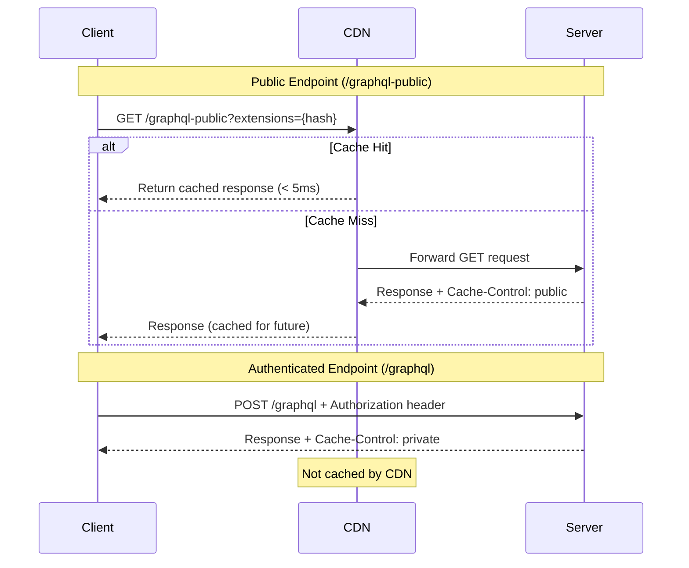

# Public GraphQL Caching for CDN and Network Providers

## Context and Problem Statement

ShareThrift serves both authenticated users (managing events, communities, memberships) and unauthenticated visitors (browsing public event listings, viewing community pages). Public content could benefit from CDN caching (Cloudflare, Fastly) and network provider caching, but GraphQL's default behavior creates challenges:

1. JWT tokens in requests prevent public caching
2. POST requests aren't cached by CDNs by default
3. Full query strings increase bandwidth consumption
4. Risk of accidentally caching authenticated data and exposing sensitive information

We need guidance for enabling public caching of unauthenticated queries while maintaining security.

## Decision Drivers

- **Security**: Prevent JWT token leakage and accidental caching of sensitive data
- **Performance**: Reduce server load and improve response times for public content
- **Compatibility**: Work with existing GraphQL tooling (Apollo Client/Server)
- **Maintainability**: Clear separation between public and private queries
- **Measurability**: Validate caching effectiveness through monitoring

## Considered Options

### Option 1: Separate Endpoints (Public + Authenticated)

Create two distinct GraphQL endpoints:
- `/graphql` - Authenticated, requires JWT, POST requests
- `/graphql-public` - No auth, GET requests with APQ

### Option 2: Same Endpoint with Conditional Auth

Use a single endpoint with conditional authentication based on query/operation.

### Option 3: No Public Caching

Continue with current approach - all queries authenticated, no public caching.

## Decision Outcome

Chosen option: **Separate endpoints** - `/graphql` for authenticated requests and `/graphql-public` for public requests.

**Security**: Physical separation eliminates token leakage risk. Public endpoint never sees Authorization headers.

**Performance**: Each endpoint optimized for its use case - public uses GET requests with APQ and HTTP caching, authenticated uses POST with HTTP batching and DataLoader.

**Compatibility**: Standard HTTP caching works with any CDN without custom configuration.

**Maintainability**: Clear boundaries make public queries easy to audit and validate.

## Implementation Details

### Server Architecture

**Dual Endpoint Configuration:**
- Single Apollo Server instance serves both endpoints
- `/graphql` - Authenticated endpoint with POST requests and private cache headers
- `/graphql-public` - Public endpoint with GET requests and CDN-friendly cache headers

**Cache Control Strategy:**
- Public endpoint: `Cache-Control: public, max-age=300, s-maxage=3600` (5min browser, 1hr CDN)
- Authenticated endpoint: `Cache-Control: private, no-cache, no-store, must-revalidate`

**Security Considerations:**
- Public endpoint disables CSRF prevention to allow GET requests
- Must implement additional safeguards: rate limiting, request validation, header checks
- GET request query parameters transformed to request body for Apollo Server compatibility

**Request Flow:**



### Client Configuration

**Authenticated Client:**
- Targets `/graphql` endpoint
- Adds JWT token from localStorage to Authorization header
- Uses POST requests for all operations
- Compatible with HTTP batching

**Public Client:**
- Targets `/graphql-public` endpoint
- Configures Automatic Persisted Queries (APQ) with SHA-256 hashing
- Enables GET requests for hashed queries via `useGETForHashedQueries`
- No authorization headers sent
- Leverages CDN and network provider caching

### Schema Design

**Public Schema Subset:**
- Explicitly defined queries for unauthenticated access
- Examples: `publicFeed`, `publicPost`, `publicUser`
- Returns sanitized types without sensitive fields
- Clearly prefixed with `public` for auditing

**Authenticated Schema:**
- Full query set including user-specific operations
- Includes personalized queries: `myFeed`, `myProfile`
- Returns complete types with all fields
- Requires valid JWT token

### Cache-Control Headers

**Public Endpoint Strategy:**
- `max-age=300`: Browser caches for 5 minutes
- `s-maxage=3600`: CDN/shared caches for 1 hour
- `public`: Explicitly allows intermediate caching

**Authenticated Endpoint Strategy:**
- `private`: Only browser may cache (not CDN)
- `no-cache`: Must revalidate before using cached copy
- `no-store`: Prevent any caching mechanism from storing data
- `must-revalidate`: Strict cache validation required

## Automatic Persisted Queries (APQ)

### What is APQ?

APQ sends a SHA-256 hash of the query instead of the full query string:

```
# Without APQ (POST)
POST /graphql-public
{
  "query": "query GetFeed { feed { edges { node { id content } } } }"
}

# With APQ (GET)
GET /graphql-public?extensions={"persistedQuery":{"version":1,"sha256Hash":"abc123..."}}
```

### Benefits

1. **Reduced request size**: Hash (64 chars) vs full query (100s-1000s chars)
2. **Cacheable GET requests**: CDNs cache by URL
3. **Bandwidth savings**: Especially for mobile users

### Implementation

**Client-Side:**
- Import persisted query link from Apollo Client
- Configure SHA-256 hashing function
- Enable GET requests for hashed queries
- Chain with HTTP link

**Server-Side:**
- Apollo Server supports APQ out-of-the-box (enabled by default)
- No additional configuration required

## Consequences

### Good

1. **Reduced Server Load**
   - CDN serves 80-95% of public requests
   - Server handles only cache misses and authenticated requests
   - Scales to handle traffic spikes without infrastructure changes

2. **Improved Performance**
   - 97% faster response times for cached content (5ms vs 200ms)
   - Edge caching reduces latency for geographically distributed users
   - APQ reduces bandwidth by 90% for typical queries

3. **Security Benefits**
   - Physical endpoint separation eliminates token leakage risk
   - Clear audit trail for public vs private access
   - Impossible to accidentally cache authenticated requests

4. **Standard HTTP Compliance**
   - Works with any CDN (Cloudflare, Fastly, Akamai)
   - Compatible with ISP caching infrastructure
   - No vendor lock-in or custom configuration required

### Bad

1. **Increased Complexity**
   - Two Apollo Client instances to maintain
   - Separate schema subsets for public vs private queries
   - Must carefully categorize queries as public or private

2. **Cache Invalidation Challenges**
   - Stale data risk with long TTLs
   - Need purge strategy for urgent updates
   - CDN cache may lag behind database changes

3. **Loss of HTTP Batching**
   - GET requests cannot be batched
   - Multiple public queries = multiple HTTP requests
   - Trade-off: choose batching OR caching, not both

4. **Developer Overhead**
   - Team must understand two different patterns
   - Risk of confusion about which client to use
   - Testing requires validating both endpoints

## ShareThrift Query Classification

| Query | Public? | Reason |
|-------|---------|--------|
| `userById()` |  Yes | Should be able to see users' pages, specifics may be blocked |
| `accountPlans()` |  Yes | Shown to unauthenticated users during signup |
| `currentUser()` |  No | requires authentication and could cause errors |
| `adminUserById()` |  No | specific calls like this could leak sensitive info |


### Alternative Approach: Same Endpoint with Conditional Auth

This approach uses a single `/graphql` endpoint for both authenticated and public queries, with conditional logic to determine when to include authentication headers.

**How It Works:**
1. Client maintains whitelist of operations requiring authentication
2. Context link checks operation name before adding auth header
3. Public queries send custom header to signal caching eligibility
4. Server reads header and sets cache policy dynamically
5. Single Apollo Server instance handles both request types

**Drawbacks:**
- Security risk: Misconfigured whitelist could expose tokens to CDN
- Maintenance burden: Must keep operation whitelist synchronized
- Audit complexity: Harder to track which queries are public
- Testing overhead: More edge cases to validate

**Not Recommended** - Separate endpoints provide clearer security boundaries


## More Information

- [Social-Feed Demo Application](https://github.com/jason-t-hankins/Social-Feed/)
- [Apollo Server: Automatic Persisted Queries](https://www.apollographql.com/docs/apollo-server/performance/apq/)
- [MDN: HTTP Caching](https://developer.mozilla.org/en-US/docs/Web/HTTP/Caching)
- [GraphQL over HTTP Specification](https://graphql.github.io/graphql-over-http/)
- [Cloudflare: CDN Caching Best Practices](https://www.cloudflare.com/learning/cdn/caching-best-practices/)