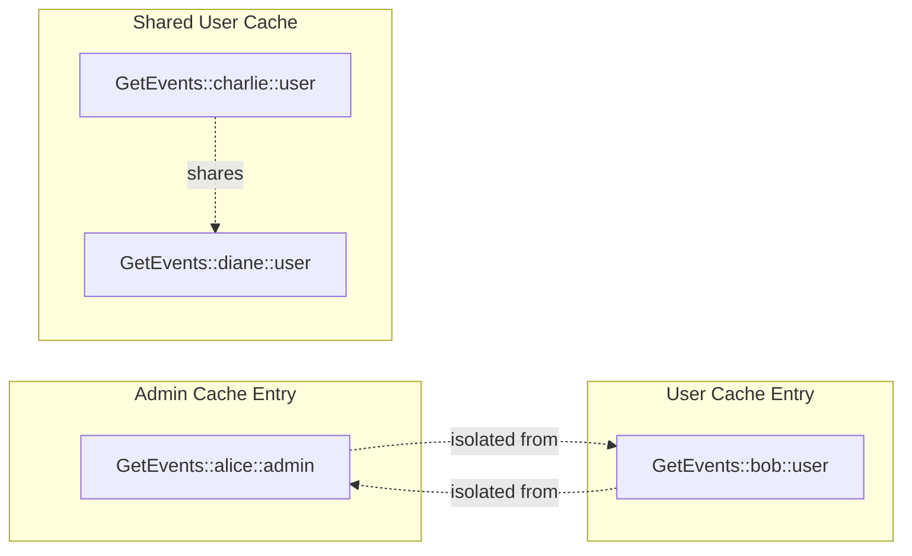
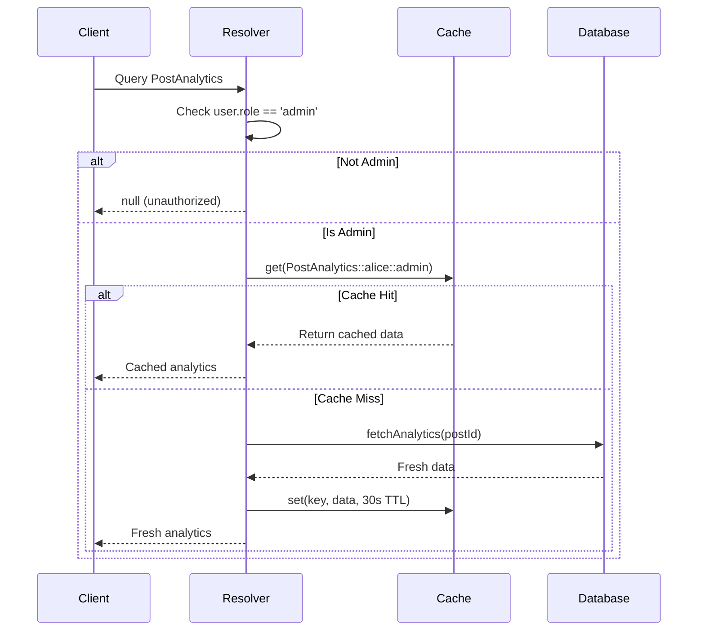

# Permission-Aware In-Memory Caching for GraphQL

## Context and Problem Statement

ShareThrift's GraphQL API serves data to users with different permission levels - personal users, and admin users. A naive server-side caching implementation could accidentally serve admin-only data to regular users through the cache response, creating serious security vulnerabilities.

## Decision Drivers

- **Security**: Users must never receive data they're not authorized to see
- **Performance**: Avoid re-computing the same data for users with identical permissions
- **Memory Efficiency**: Don't cache duplicate data unnecessarily
- **Maintainability**: Clear, auditable permission checks
- **Scalability**: Support complex permission models (roles, groups, ACLs)

## Considered Options

### Option 1: No Server-Side Caching

Compute fresh data for every GraphQL request without any caching layer.

**Benefits:**
- Zero risk of serving stale or incorrect data
- No permission leakage concerns
- Simplest implementation with no cache management overhead

**Trade-offs:**
- Database executes same queries repeatedly for identical requests
- 50-200ms database query latency on every request
- Server load increases linearly with request volume
- Not viable for production scale with high traffic

### Option 2: Permission-Aware Cache Keys

Include user permissions (userId, role, permissions array) in cache keys to ensure isolation between permission levels.

**Benefits:**
- Users with identical permissions share cache entries (1000 members = 1 cache entry)
- 70-90% reduction in database queries for same permission sets
- Cache lookups under 1ms vs 50-200ms database queries
- Supports complex permission models (RBAC, ABAC, custom)
- Zero risk of permission leakage between users

**Trade-offs:**
- One cache entry per unique permission set increases memory usage
- Changing user permissions requires invalidating their cache entries
- First request for each permission level suffers cold cache penalty
- Team must understand cache key composition and invalidation strategies

### Option 3: Post-Fetch Filtering

Cache full dataset without permission context, then filter based on user permissions before returning.

**Benefits:**
- Single cache entry serves all users regardless of permissions
- Minimal memory usage
- Simple cache key structure

**Trade-offs:**
- Security risk: Full data including sensitive fields stored in cache
- Performance penalty: Must filter on every request negating cache benefits
- Cache inspector or debugging could expose unauthorized data
- Violates defense-in-depth security principle

### Option 4: Separate Queries Per Permission Level

Create distinct GraphQL queries for each permission level (e.g., `adminFeed`, `userFeed`, `premiumFeed`).

**Benefits:**
- Clear separation between permission levels
- Simple caching without permission logic in keys
- Explicit schema defines what each role can access

**Trade-offs:**
- Schema duplication for similar queries across permission levels
- Maintenance burden: Update multiple queries when schema changes
- Client complexity: Must know which query to call for current user
- Doesn't scale with fine-grained or dynamic permissions

## Decision Outcome

Recommended option: **Permission-aware cache keys** - Include user permissions in cache keys to ensure isolation between permission levels.

Cache keys include query, variables, userId, role, and permissions array (e.g., `GetEvents::{"first":5}::alice::admin::[]` vs `GetEvents::{"first":5}::bob::member::[]`) ensuring users cannot access cached data for other permission levels while allowing users with identical permissions to share cache entries (1000 regular members = 1 cache entry). GraphQL resolvers perform permission checks before returning fields and store only filtered results in cache, delivering 70-90% reduction in database queries for users with same permissions with cache lookups under 1ms vs 50-200ms database queries. In-memory Map-based storage provides fast lookups with configurable max size (default 1000 entries) and TTL (default 60 seconds), using LRU eviction when max size is reached. ShareThrift implements hybrid invalidation strategy combining 30-60 second TTL with event-based invalidation on mutations for balance between fresh data and cache efficiency, with per-role cache hit/miss logging for monitoring and optimization.

## Technical Considerations

- Cache keys concatenate query name, JSON-stringified variables, userId, role, and sorted permissions array into unique string (e.g., `GetFeedWithAnalytics::{"first":5}::alice::admin::[]`)
- Permission check occurs before cache lookup - unauthorized requests return null immediately without caching
- Resolvers check permissions at field level, storing only filtered results in cache to prevent sensitive data leakage
- In-memory Map-based storage provides sub-millisecond lookups with automatic cleanup of expired entries
- LRU eviction strategy enforces max size limit (default 1000 entries) by removing oldest entry when capacity reached
- TTL-based expiration (default 60 seconds) with per-entry TTL override support balances freshness with cache efficiency
- Pattern-based invalidation supports wildcard matching on query, userId, or role for targeted cache clearing on mutations
- Cache key granularity configurable: role-level for shared non-personalized data (all admins share analytics dashboard), user-level for personalized data (each user's feed)
- Hybrid invalidation strategy combines TTL expiration with event-based mutations for immediate freshness with safety net
- Works with Apollo Server, Express GraphQL, and existing DataLoader optimizations without conflicts

### Cache Invalidation Strategies

**Time-Based (TTL):** Entries expire after configured duration (30-60 seconds recommended). Simple and predictable but may serve stale data for TTL duration.

**Event-Based:** Manually invalidate on mutations by updating database then invalidating affected cache queries. Always fresh data but more complex with risk of over-invalidation. Examples include: Role change, data update.

**Hybrid (Recommended):** Combine 30-60 second TTL with mutation-based invalidation. Provides fresh data for mutations with TTL safety net for missed invalidations. Limits to cache memory should be set and an algorithm like LRU or FIFO should be used to evict cache entries.

## Consequences

- Good: zero risk of permission leakage between users with cache key isolation
- Good: 70-90% reduction in database queries for users with same permissions
- Good: cache lookups under 1ms vs 50-200ms database queries
- Good: supports complex permission models (RBAC, ABAC, custom)
- Good: cache hits and misses logged per role for monitoring and optimization
- Bad: one cache entry per unique permission set increases memory usage
- Bad: changing user permissions requires invalidating their cache entries
- Bad: first request for each permission level suffers cold cache penalty
- Bad: team must understand cache key composition and invalidation strategies

## Implementation Details

### Cache Isolation Diagram

### Permission-Aware Resolver Flow

## Validation with Performance Testing

Created a single test page to validate caching

1. **Public Caching Test** ([PermissionCacheDemo.tsx](https://github.com/jason-t-hankins/Social-Feed/blob/main/client/src/demos/04-permission-cache/PermissionCacheDemo.tsx))
   - Demonstrates server-side in-memory caching that respects user permissions.

## More Information

- [Social-Feed Demo Application](https://github.com/jason-t-hankins/Social-Feed/)
- [Apollo Server: Field-Level Authorization](https://www.apollographql.com/docs/apollo-server/security/authentication/#authorization-in-resolvers)
- [Redis: Caching Best Practices](https://redis.io/docs/manual/patterns/caching/)
- [NPM: LRU Cache Implementation](https://www.npmjs.com/package/lru-cache)