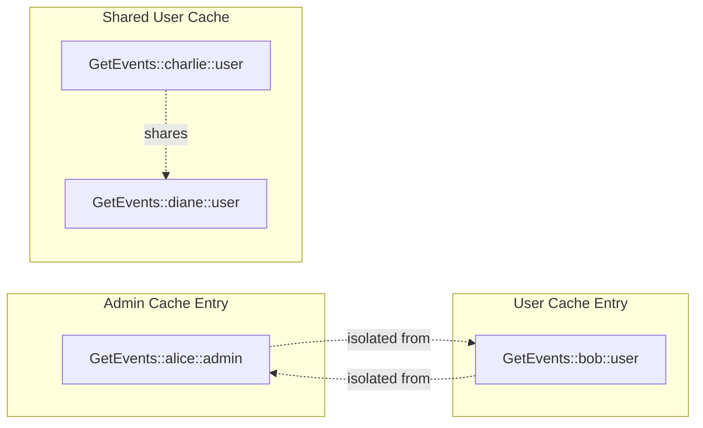
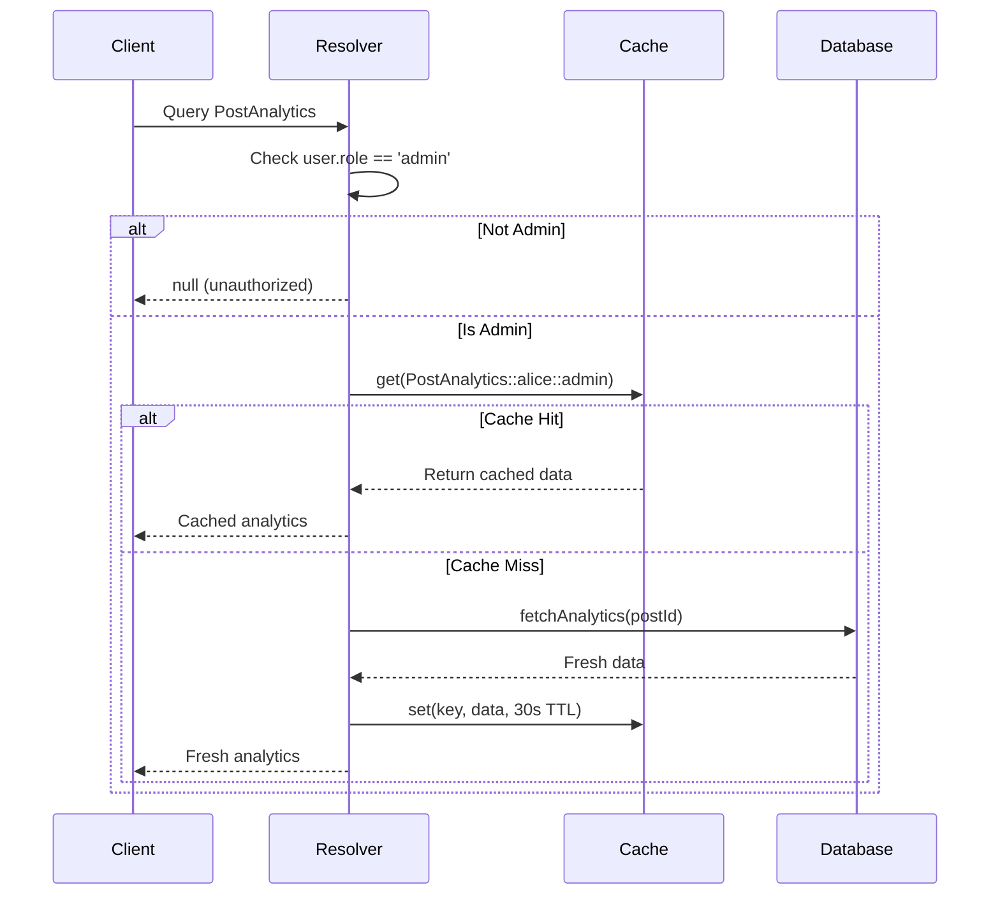

# Permission-Aware In-Memory Caching for GraphQL

## Context and Problem Statement

ShareThrift's GraphQL API serves data to users with different permission levels - regular members, community admins, and platform administrators. A naive server-side caching implementation could accidentally serve admin-only data to regular users, creating serious security vulnerabilities.

For example, admin users viewing event analytics (attendance rates, revenue) and regular members viewing the same event listing must not share cached data. Without permission-aware caching, an admin's cached response could leak sensitive information to regular users.

## Decision Drivers

- **Security**: Users must never receive data they're not authorized to see
- **Performance**: Avoid re-computing the same data for users with identical permissions
- **Memory Efficiency**: Don't cache duplicate data unnecessarily
- **Maintainability**: Clear, auditable permission checks
- **Scalability**: Support complex permission models (roles, groups, ACLs)

## Considered Options

### Option 1: No Server-Side Caching

Don't cache at the GraphQL layer - compute fresh for every request.

### Option 2: Permission-Aware Cache Keys

Include user permissions in cache keys to ensure isolation between permission levels.

### Option 3: Post-Fetch Filtering

Cache the full dataset, then filter based on permissions before returning.

### Option 4: Separate Queries Per Permission Level

Create distinct queries for each permission level (e.g., `adminFeed`, `userFeed`).

## Decision Outcome

Chosen option: **Permission-aware cache keys** - Include user permissions in cache keys to ensure isolation between permission levels.

**Security**: Cache keys include query, variables, userId, role, and permissions. Example: `GetEvents::{"first":5}::alice::admin::[]` vs `GetEvents::{"first":5}::bob::member::[]`. Users cannot access cached data for other permission levels.

**Efficiency**: Users with identical permissions share cache entries. 1000 regular members = 1 cache entry.

**Field-Level Control**: GraphQL resolvers check permissions before returning fields, storing only filtered results in cache.

**Compatibility**: Works with Apollo Server, Express GraphQL, and existing DataLoader optimizations.

## Implementation Details

### Cache Key Structure

**Components:**
- **Query**: Operation name (e.g., "GetFeedWithAnalytics")
- **Variables**: Query parameters (e.g., `{ first: 5 }`)
- **User ID**: Unique user identifier (e.g., "507f1f77bcf86cd799439011")
- **Role**: User role (e.g., "admin", "user")
- **Permissions**: Additional permission flags (e.g., ["read:analytics"])

**Generated Key Example:**
```
GetFeedWithAnalytics::{"first":5}::alice::admin::[]
```

**Cache Isolation:**



### Permission-Aware Resolver

**Resolution Flow:**
1. **Permission Check**: Validate user has required role/permissions
2. **Early Return**: Return null for unauthorized requests (don't cache)
3. **Cache Key Generation**: Include query, variables, userId, and role
4. **Cache Lookup**: Check if entry exists for this permission context
5. **Database Fetch**: On cache miss, fetch from database
6. **Cache Storage**: Store with TTL (typically 30-60 seconds)
7. **Return Data**: Provide cached or fresh data to client

**Resolver Flow:**



### Cache Implementation

**Core Features:**
- In-memory Map-based storage for fast lookups (< 1ms)
- Configurable max size (default: 1000 entries)
- Configurable default TTL (default: 60 seconds)
- LRU (Least Recently Used) eviction when max size reached

**Key Methods:**

**generateKey**: Concatenates query, variables, userId, role, and permissions into unique string

**get**: 
- Generates cache key from components
- Checks if entry exists and is not expired
- Returns data or null (with automatic cleanup of expired entries)

**set**:
- Enforces max size limit with LRU eviction
- Stores data with timestamp and TTL
- Allows per-entry TTL override

**invalidate**:
- Pattern-based cache clearing
- Supports wildcard matching on query, userId, or role
- Returns count of deleted entries for monitoring


## Consequences

- Good, because zero risk of permission leakage between users
- Good, because reduces database queries by 70-90% for users with same permissions
- Good, because cache lookups under 1ms vs 50-200ms database queries
- Good, because supports complex permission models (RBAC, ABAC, custom)
- Good, because cache hits and misses logged per role for monitoring
- Bad, because one cache entry per unique permission set increases memory usage
- Bad, because changing user permissions requires invalidating their cache entries
- Bad, because first request for each permission level is always slow (cold cache)


## Trade-Offs

### Memory vs. Performance

**Low TTL (Time to Live) (10-30s):**
- Fresh data
- Lower memory usage
- ...More database queries

**High TTL (5-10min):**
- Fewer database queries
- Better performance
- ...Higher memory usage
- ...Stale/Outdated data risk

**Recommendation**: 30sec-5min TTL for most use cases (Feed, Dashboard, User Profile, etc.)

### Granularity

**Coarse (role-level):**
- Cache key includes query, variables, and role only
- All users with same role share cache entry
- Best for non-personalized data
- Example: All admins see same analytics dashboard

**Fine (user-level):**
- Cache key includes query, variables, userId, and role
- Each user has isolated cache entry
- Required for personalized data
- Example: Each user's personal feed

**Recommendation**: 
- Use role-level for data that doesn't vary per user
- Use user-level for personalized data
- Hybrid approach: include `userId` only when needed

## Cache Invalidation Strategies

### Time-Based (TTL)

Entries automatically expire after configured duration (e.g., 60 seconds).

**Pros:** Simple, predictable
**Cons:** May serve stale data for TTL duration

### Event-Based

Manually invalidate cache entries when underlying data changes (e.g., on mutations).

**Process:**
1. Update data in database
2. Invalidate affected cache queries
3. Next request fetches fresh data

**Pros:** Always fresh data
**Cons:** More complex, can invalidate too aggressively

### Hybrid (Recommended)

Combine TTL expiration with event-based invalidation:
- Set reasonable TTL (30-60 seconds)
- Invalidate on mutations for immediate freshness
- TTL serves as safety net for missed invalidations

**Balance:** Fresh data for mutations, caching for reads

## Real-World Scenarios

### Scenario 1: Role Change

**Problem:** Alice is promoted from `user` to `admin`

**Solution:**
1. Update user role in database
2. Invalidate all cache entries matching userId
3. Next request generates fresh cache with new role
4. User immediately sees admin-only data

### Scenario 2: Data Update

**Problem:** Admin updates a post, all users should see new content

**Solution:**
1. Update post in database
2. Invalidate all cache entries for affected queries (GetFeed, GetPost)
3. Clear cache across all user roles
4. Next request for any user fetches fresh data

### Scenario 3: Permission Check Change

**Problem:** Analytics permission logic changes (now requires `premium` flag)

**Solution:**
1. Update resolver permission check to require admin OR premium
2. Modify cache key generation to include premium flag in permissions array
3. During deployment, invalidate all PostAnalytics cache entries
4. New cache entries generated with updated permission model
5. Admin and premium users both see analytics (in separate cache entries)

## Edge Cases & Mitigations

### Edge Case: Permission Check in Middle of Resolver Chain

**Problem:**
Root query fetches all posts without permission check, but nested field `analytics` requires admin role. If we cache at root query level, admin and user caches would be identical.

**Solution:**
Cache at the field level where permission check occurs:
1. Root query (posts) caches without permission context
2. Nested field (analytics) caches with role in key
3. Admin gets cached analytics, user gets null
4. Two separate cache entries maintain security boundary

### Edge Case: Dynamic Permissions

**Problem:** User has permission `["posts:read:own"]` - can only read their own posts

**Solution:**
1. Include userId in cache key (not just role)
2. Include full permissions array in cache key
3. Each user gets isolated cache entry
4. No risk of cross-user data leakage

### Edge Case: Memory Leak from User Churn

**Problem:** 10,000 users log in once, cache grows unbounded

**Solution:**
1. Enforce maximum cache size limit (e.g., 1000 entries)
2. Implement LRU (Least Recently Used) eviction strategy
3. When max size reached, remove oldest entry before adding new one
4. Protects against memory exhaustion from one-time users

## Monitoring & Observability

### Key Metrics

```typescript
interface CacheMetrics {
  totalSize: number;          // Current cache entry count
  hitRate: number;           // Percentage of cache hits
  hitsByRole: Map<string, number>;  // Cache hits per role
  missedByRole: Map<string, number>; // Cache misses per role
  avgTTL: number;            // Average entry age
  evictionCount: number;     // Times max size was hit
}
```

### Logging

```typescript
cache.get(key) {
  if (cached) {
    console.log(`[Cache HIT] ${key.query} for role=${key.role}`);
  } else {
    console.log(`[Cache MISS] ${key.query} for role=${key.role}`);
  }
}

cache.invalidate(pattern) {
  console.log(`[Cache INVALIDATE] ${deletedCount} entries`, pattern);
}
```


## More Information

- [Social-Feed Demo Application](https://github.com/jason-t-hankins/Social-Feed/)
- [Apollo Server: Field-Level Authorization](https://www.apollographql.com/docs/apollo-server/security/authentication/#authorization-in-resolvers)
- [Redis: Caching Best Practices](https://redis.io/docs/manual/patterns/caching/)
- [NPM: LRU Cache Implementation](https://www.npmjs.com/package/lru-cache)