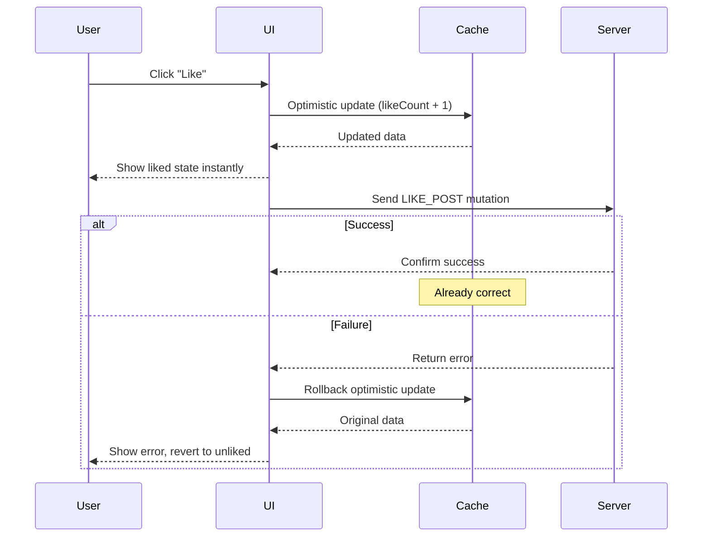
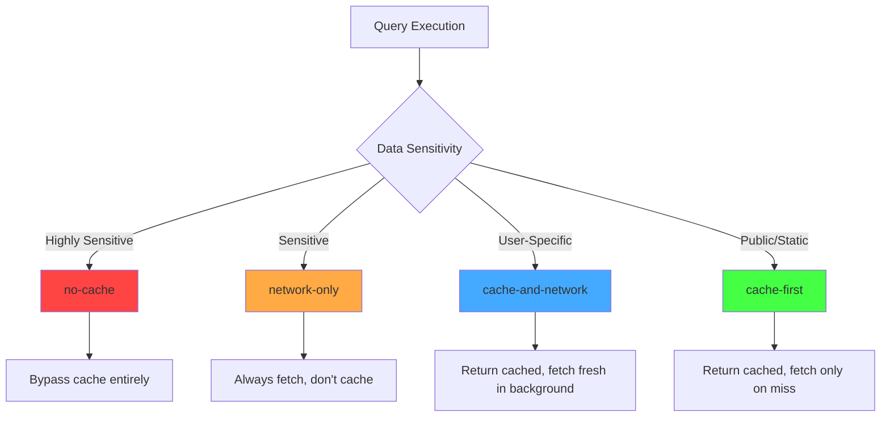

# Client-Side Caching with Apollo Client

## Context and Problem Statement

ShareThrift requires responsive UI and reduced server load through effective client-side caching. Apollo Client provides a normalized cache, but we need clear guidance on:

- Cache policy selection (cache-first, network-only, cache-and-network)
- Security considerations for preventing sensitive data exposure in client cache
- Cache invalidation strategies for mutations
- Effective use of Apollo DevTools for debugging

This decision focuses on cache policy patterns with emphasis on security and data freshness requirements.

## Decision Drivers

- Performance: Minimize network requests and server load
- Security: Never expose sensitive data in client cache
- User Experience: Instant UI updates with optimistic responses
- Data Freshness: Balance caching with real-time requirements
- Developer Experience: Clear patterns that scale with team size

## Considered Options

### Apollo Client vs Alternatives

Evaluated: Apollo Client, TanStack Query, SWR, Redux RTK Query

**Apollo Client chosen for**:
- Automatic normalization (User:123 cached once, shared across queries)
- GraphQL-first with fragments, type policies, subscriptions
- Field policies for data transformation/masking
- Excellent DevTools

**Trade-offs**:
- Bundle size: 33 KB vs 5-13 KB for alternatives
- Learning curve: normalization and cache keys
- GraphQL-only (can't cache REST easily)

**Rationale**: For GraphQL projects with complex data relationships, Apollo's normalized cache and GraphQL-specific features provide best DX and performance.

### Cache Policies

Apollo Client offers multiple fetch policies:

#### cache-first (Default)
Read from cache, fetch on cache miss. Best for static/public data.

**Behavior**: Check cache first, only fetch if data not found

**Use cases**: Product catalogs, blog posts, reference data

#### network-only
Always fetch fresh, appropriate for sensitive data.

**Behavior**: Always fetch from network, update cache but never read from it

**Use cases**: Bank balances, private messages, real-time data

#### cache-and-network
Show cached instantly, refresh in background.

**Behavior**: Return cached data immediately, then fetch fresh and update

**Use cases**: Social feeds, dashboards

#### no-cache
Bypasses cache entirely for single-use data.

**Behavior**: Fetch from network, don't read or write to cache

**Use cases**: OTP codes, reset tokens

### Field-Level Security

Use field policies to mask sensitive data even if server returns real values.

**Implementation:**
- Configure type policies in InMemoryCache
- Define custom read functions for sensitive fields
- Read function returns masked value (e.g., '***-**-****')
- Original server data never exposed in cache

**Benefits**: Defense-in-depth, cache inspector safety, redacted logs

### Varying Field Selections

Apollo merges queries with different fields into same cache entry.

Query minimal fields first, then full profile:
- Minimal query caches 3 fields
- Full query merges 6 fields total
- Subsequent minimal queries read all 6 from cache

Key insight: Query broader fields first, narrower queries benefit from cache.

### useFragment for Cache Reads

Read cached data without network request.

**Process:**
- Component receives entity ID as prop
- useFragment reads directly from cache using fragment definition
- Returns complete flag (true if all fields available) and data
- Component subscribes to cache updates for that entity

**Benefits**: Zero network overhead, live updates, avoids prop drilling

See [ADR 0024](./0024-usefragment-vs-httpbatch-dataloader.md) for re-render optimization details.

### Optimistic Updates

Update UI instantly before server confirms mutation success.

**Process:**
1. User triggers mutation (e.g., like post)
2. Client immediately updates cache with predicted response
3. UI reflects change instantly
4. Mutation sent to server
5. On success: cache already correct
6. On failure: Apollo automatically rolls back optimistic update

**Use cases**: Likes, favorites, toggles

**Optimistic Update Flow:**

## Decision Outcome

Chosen option: **Tiered caching strategy** based on data sensitivity and freshness requirements.

**Tier 1 - Public/Static (cache-first)**: Event listings, community pages, account plans

**Tier 2 - User-Specific (cache-and-network)**: User feeds, event attendance, notifications

**Tier 3 - Sensitive (network-only)**: Payment information, admin data, private messages

**Tier 4 - Highly Sensitive (no-cache)**: Passwords, credit cards, OTP codes

**Field-Level Policies**: Mask sensitive fields even if server sends real data (defense-in-depth)

**Optimistic Updates**: Use for likes, follows, attendance toggles. Avoid for complex validations and transactions.

**Cache Policy Decision Flow:**

### Implementation for ShareThrift

**Configure Cache:**
- Initialize InMemoryCache with type policies
- Define key fields for entity identification (typically 'id')
- Configure field policies for sensitive data masking
- Example: Mask email field to always return redacted value

**Apply Policies:**
- **Public event listings**: `cache-first` for maximum caching
- **User-specific feed**: `cache-and-network` for instant display with background refresh
- **Payment information**: `network-only` to always fetch fresh, never cache

## Cache Invalidation

### Refetch Queries

Specify queries to automatically refetch after mutation completes.
- Provide array of query names
- Apollo automatically re-executes those queries
- Simple but can cause unnecessary network requests

### Cache Eviction

Manually remove entries from cache after mutation.
- Use `cache.evict()` to remove specific entity by ID
- Use `cache.gc()` to garbage collect orphaned references
- More precise than refetchQueries, avoids network requests

### Polling (use sparingly)

Periodically refetch query at fixed interval (e.g., every 5 seconds).
- Simple real-time updates for non-critical data
- Inefficient compared to subscriptions
- Use only when subscriptions not feasible

## Tooling and Debugging

### Apollo DevTools
Chrome/Firefox extension for cache inspection, query tracking, mutation debugging

### Browser Network Tab
Filter by `graphql` to verify cache behavior:
- cache-first: no network request after first fetch
- network-only: always hits network

### Cache Debugging

Extract entire cache contents for inspection.
- Use `client.cache.extract()` to view all cached entities
- Helpful for debugging unexpected cache behavior
- Can log to console or use Apollo DevTools for visual inspection

## Consequences

- Good, because instant UI response for cached data reduces perceived latency
- Good, because reduced server load lowers infrastructure costs
- Good, because field policies prevent sensitive data exposure as defense-in-depth
- Good, because optimistic updates provide immediate user feedback
- Good, because Apollo DevTools enable effective cache debugging
- Bad, because requires understanding cache normalization and key generation
- Bad, because aggressive caching risks stale data without proper invalidation
- Bad, because large caches consume client memory (target: 10-50 MB)
- Bad, because cache issues can be subtle to debug

## More Information

- [Social-Feed Demo Application](https://github.com/jason-t-hankins/Social-Feed/)
- [Apollo Client: Caching Overview](https://www.apollographql.com/docs/react/caching/overview/)
- [Apollo Client: Fetch Policies](https://www.apollographql.com/docs/react/data/queries/#setting-a-fetch-policy)
- [Apollo DevTools](https://www.apollographql.com/docs/react/development-testing/developer-tooling/#apollo-client-devtools)
