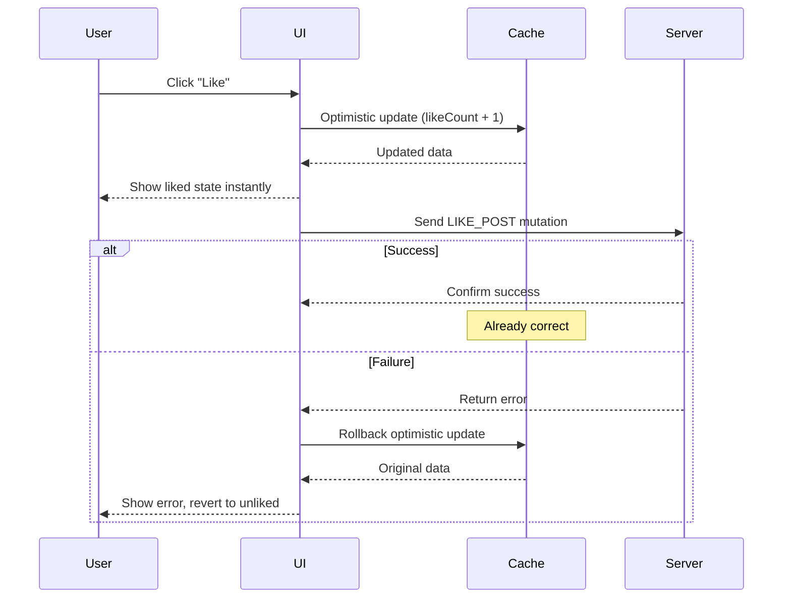
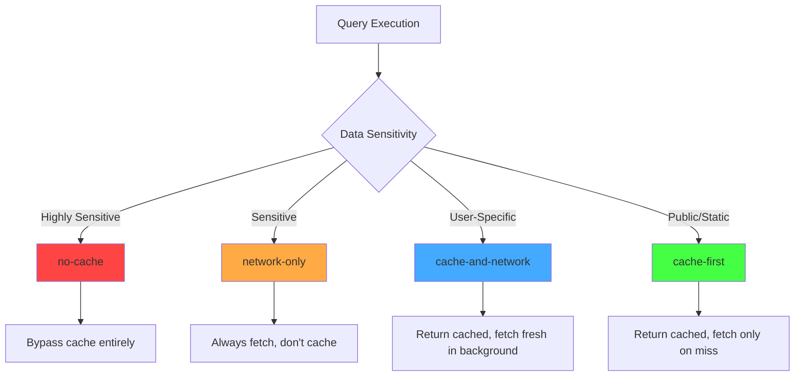

# Client-Side Caching with Apollo Client

## Context and Problem Statement

ShareThrift requires responsive UI and reduced server load through effective client-side caching. Apollo Client provides a normalized cache, but we need clear guidance on:

- Cache policy selection (cache-first, network-only, cache-and-network)
- Security considerations for preventing sensitive data exposure in client cache
- Cache invalidation strategies for mutations

This decision focuses on cache policy patterns with emphasis on security and data freshness requirements.

## Decision Drivers

- Performance: Minimize network requests and server load
- Security: Never expose sensitive data in client cache
- User Experience: Instant UI updates with optimistic responses
- Data Freshness: Balance caching with real-time requirements
- Developer Experience: Clear patterns that scale with team size

## Considered Options / Areas of Research

### Cache Policies

Apollo Client offers multiple fetch policies:

#### cache-first (Default)
Read from cache, fetch on cache miss. Best for static/public data. Useful for product catalogs, blog posts, reference data

#### network-only
Always fetch fresh (though update cache anyway), appropriate for sensitive data. Useful for bank balances, private messages, real-time data

#### cache-and-network
Show cached instantly, refresh in background. Useful for social feeds, dashboards

#### no-cache
Bypasses cache entirely for single-use data. Useful for OTP codes, reset tokens

### Field-Level Security

Use field policies to mask sensitive data even if server returns real values.

**Implementation:**
- Configure type policies in InMemoryCache
- Define custom read functions for sensitive fields
- Read function returns masked value (e.g., '***-**-****')
- Original server data never exposed in cache

### Varying Field Selections

Apollo merges queries with different fields into same cache entry.

Query minimal fields first, then full profile:
- Minimal query caches 3 fields
- Full query merges 6 fields total
- Subsequent minimal queries read all 6 from cache, eliminating excess entries

### Optimistic Updates

Update UI instantly before server confirms mutation success. Useful for likes, favorites, toggles. Improves UX.

**Optimistic Update Flow:**

## Decision Outcome

**Tiered caching strategy** based on data sensitivity and freshness requirements.

A one-size-fits-all cache policy creates unacceptable tradeoffs—aggressive caching risks exposing sensitive data while conservative policies sacrifice performance gains. Instead, we adopt a tiered approach that matches cache behavior to data classification. This balances security requirements (never cache sensitive data) with performance optimization (maximize caching for safe data) while providing clear guidelines for developers to apply consistently across the application.

**Tier 1 - Public/Static (cache-first)**: item listings, user profiles, account plans

**Tier 2 - User-Specific (cache-and-network)**: User feeds

**Tier 3 - Sensitive (network-only)**: Payment information, admin data, private messages

**Tier 4 - Highly Sensitive (no-cache)**: Passwords, credit cards, OTP codes

**Field-Level Policies**: Mask sensitive fields even if server sends real data (defense-in-depth)

**Optimistic Updates**: Use for likes, follows, attendance toggles. Avoid for complex validations and transactions.

**Cache Policy Decision Flow:**

## Technical Considerations

### Cache Invalidation Strategies

Apollo Client provides three approaches for keeping cached data fresh after mutations. **refetchQueries** automatically re-executes specified queries after mutation completion by providing array of query names—simple but causes unnecessary network requests for all queries even if only subset affected. **Cache Eviction** manually removes entries by calling cache eviction methods to delete specific entity by identifier and garbage collect orphaned references—more precise than refetchQueries and avoids unnecessary network traffic. **Polling** periodically refetches query at fixed interval (e.g., every 5 seconds) for simple real-time updates on non-critical data—inefficient compared to GraphQL subscriptions and should only be used when subscriptions not feasible.

### Field-Level Security

Apollo Client's field policies provide defense-in-depth by masking sensitive data even if server mistakenly returns real values. Configure type policies in InMemoryCache with custom read functions for sensitive fields (SSN, credit cards, passwords). The read function intercepts cache reads and returns masked values ensuring original server data never exposed in cache inspector, console logs, or debugging tools. This pattern protects against both server bugs and client-side inspection.

### Cache Normalization and Field Selection

Apollo automatically merges queries with different field selections into same cache entry. When component A queries minimal user fields and component B later queries full user profile with additional fields, Apollo merges all fields into single cache entry for that user. Subsequent queries for any subset of those fields read from cache without network request. Key insight: query broader field sets first to maximize cache utilization for narrower queries. This normalization eliminates data duplication across queries.

### Debugging and Monitoring

[Apollo DevTools](https://chromewebstore.google.com/detail/apollo-client-devtools/jdkknkkbebbapilgoeccciglkfbmbnfm) Chrome/Firefox extension provides visual cache inspection, query tracking, and mutation debugging. Use cache extraction methods to dump entire cache contents for debugging unexpected behavior—helpful for logging or console inspection. Monitor cache size in production (target: 10-50 MB) to prevent memory issues. Use browser network tab filtered by graphql to verify cache behavior: cache-first shows no network request after initial fetch, network-only always hits network.

## Consequences

- Good, because instant UI response for cached data reduces perceived latency
- Good, because reduced server load lowers infrastructure costs
- Good, because field policies prevent sensitive data exposure as defense-in-depth
- Good, because optimistic updates provide immediate user feedback
- Good, because Apollo DevTools enable effective cache debugging
- Bad, because requires understanding cache normalization and key generation
- Bad, because aggressive caching risks stale data without proper invalidation
- Bad, because large caches consume client memory (target: 10-50 MB)
- Bad, because cache issues can be subtle to debug

## Validation with Performance Testing

Created a single test page to validate caching

1. **Public Caching Test** ([ClientCacheDemo.tsx](https://github.com/jason-t-hankins/Social-Feed/blob/main/client/src/demos/05-client-cache/ClientCacheDemo.tsx))
   Simplified demo focused on the key requirements:
   1. Varying field selections and cache merge behavior
   2. Public vs private data caching strategies
   3. Cache inspection with Apollo DevTools
   4. Field-level security (SSN masking)

## More Information

- [Social-Feed Demo Application](https://github.com/jason-t-hankins/Social-Feed/)
- [Apollo Client: Caching Overview](https://www.apollographql.com/docs/react/caching/overview/)
- [Apollo Client: Fetch Policies](https://www.apollographql.com/docs/react/data/queries/#setting-a-fetch-policy)
- [Apollo DevTools](https://www.apollographql.com/docs/react/development-testing/developer-tooling/#apollo-client-devtools)
