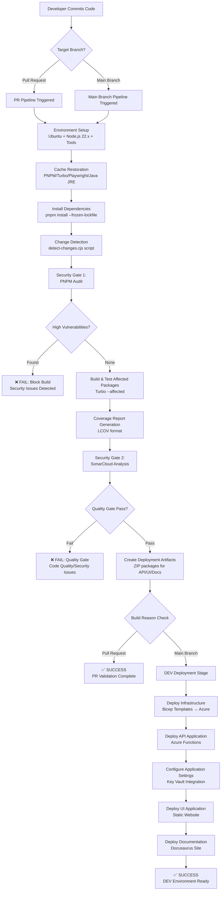

# ShareThrift CI/CD Pipeline Flow

This document details the complete CI/CD pipeline flow for ShareThrift, highlighting security gates and deployment processes.

## Pipeline Overview

Our pipeline implements a **security-first approach** with multiple gates that must pass before code reaches production. The pipeline automatically detects affected packages and only deploys when changes are detected.

## Complete Pipeline Flow



## Pipeline Stages Breakdown

### **Stage 1: Environment Setup**
- **Agent**: Ubuntu Latest
- **Runtime**: Node.js 22.x
- **Tools**: Azure Functions Core Tools 4.2.1, PNPM Latest-10
- **Caching**: Multiple cache layers for performance optimization

### **Stage 2: Dependency Management**
```bash
# Install dependencies with frozen lockfile
pnpm install --frozen-lockfile

# Detect which packages are affected by changes
node ./build-pipeline/scripts/detect-changes.cjs
```

### **Stage 3: Security Gates**

#### **Security Gate 1: Dependency Vulnerability Scanning**
```bash
# PNPM Audit - High severity threshold
pnpm audit --audit-level=high --prod
```
- **Purpose**: Detect known vulnerabilities in production dependencies
- **Threshold**: High severity issues block the build
- **Scope**: Production dependencies only

#### **Security Gate 2: Static Code Analysis**
```bash
# SonarCloud Analysis
pnpm run sonar -Dsonar.pullrequest.key="$PR_NUMBER" \
               -Dsonar.pullrequest.branch="$PR_BRANCH" \
               -Dsonar.pullrequest.base=main
```
- **Tool**: SonarCloud
- **Organization**: `simnova`
- **Project**: `simnova_sharethrift-data-access`
- **Quality Gate**: Enforced (breaks build on failure)

### **Stage 4: Build & Test**
```bash
# Build and test only affected packages
pnpm run test:coverage --affected

# Merge coverage reports for SonarCloud
pnpm run merge-lcov-reports
```

### **Stage 5: Deployment (Main Branch Only)**

#### **Deployment Conditions**
- ✅ All security gates passed
- ✅ Build reason is NOT Pull Request
- ✅ Changes detected in affected packages

#### **Infrastructure Deployment**
```yaml
- task: AzureResourceManagerTemplateDeployment@3
  inputs:
    csmFile: apps/api/iac/main.bicep
    csmParametersFile: apps/api/iac/dev.bicepparam
```

#### **Application Deployment**
```yaml
- task: AzureFunctionApp@1
  inputs:
    appName: $(functionAppNamePri)
    package: '$(Pipeline.Workspace)/api/api-$(Build.BuildId).zip'
    runtimeStack: 'NODE|22'
```

## Key Pipeline Features

### **Change Detection**
- Uses Turbo's `--affected` flag for intelligent change detection
- Only builds and deploys packages that have changes
- Compares against target branch (main) for PR builds

### **Caching Strategy**
- **PNPM Store**: Package dependency caching
- **Turbo Cache**: Build artifact caching
- **Playwright Browsers**: Browser binary caching
- **Java JRE**: SonarCloud scanner dependency caching
- **SonarCloud Scanner**: Analysis engine caching

### **Security Integration Points**

| Stage | Security Tool | Purpose | Failure Action |
|-------|---------------|---------|----------------|
| Dependencies | PNPM Audit | Vulnerability scanning | Block build |
| Code Analysis | SonarCloud | Code quality & security | Block build |
| Infrastructure | Bicep Templates | Secure infrastructure | Deployment validation |
| Runtime | Azure Key Vault | Secret management | Secure configuration |
