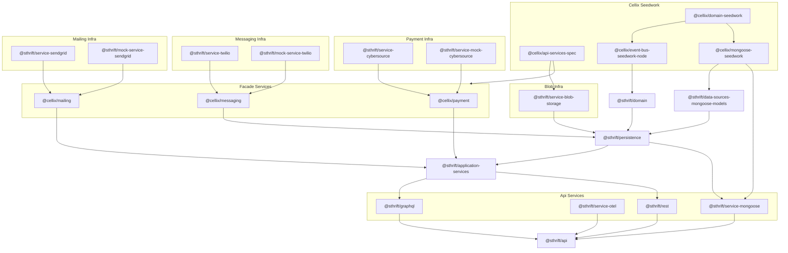

```mermaid
graph TD
  %% Cellix Seedwork (top)
  subgraph Cellix Seedwork
    cellix-api-services-spec["@cellix/api-services-spec"]
    cellix-domain-seedwork["@cellix/domain-seedwork"]
    cellix-event-bus-seedwork-node["@cellix/event-bus-seedwork-node"]
    cellix-mongoose-seedwork["@cellix/mongoose-seedwork"]
  end

  %% Infrastructure Services (split for clarity, spaced for linearity)

  subgraph Payment Infra
    sthrft-service-cybersource["@sthrift/service-cybersource"]
    sthrft-service-mock-cybersource["@sthrift/service-mock-cybersource"]
  end

  %% vertical space

  subgraph Messaging Infra
    sthrft-service-twilio["@sthrift/service-twilio"]
    sthrft-mock-service-twilio["@sthrift/mock-service-twilio"]
  end

  %% vertical space

  subgraph Mailing Infra
    sthrft-service-sendgrid["@sthrift/service-sendgrid"]
    sthrft-mock-service-sendgrid["@sthrift/mock-service-sendgrid"]
  end

  %% extra vertical space

  subgraph FacadeServices["Facade Services"]
    cellix-payment["@cellix/payment"]
    cellix-messaging["@cellix/messaging"]
    cellix-mailing["@cellix/mailing"]
  end

  %% Domain Layer
  sthrft-domain["@sthrift/domain"]

  %% Blob Infra above Persistence
  subgraph Blob Infra
    sthrft-service-blob["@sthrift/service-blob-storage"]
  end

  %% extra vertical space

  %% extra vertical space
  sthrft-data-sources-mongoose-models["@sthrift/data-sources-mongoose-models"]

  %% Persistence (below domain)
  sthrft-persistence["@sthrift/persistence"]

  %% Application Layer (below persistence)
  sthrft-application-services["@sthrift/application-services"]

  %% API Services (below app)
  subgraph Api Services
    sthrft-graphql["@sthrift/graphql"]
    sthrft-service-otel["@sthrift/service-otel"]
    sthrft-rest["@sthrift/rest"]
    sthrft-service-mongoose["@sthrift/service-mongoose"]
  end

  %% API Entrypoint (bottom)
  sthrft-api["@sthrift/api"]

  %% Connections
  cellix-domain-seedwork --> cellix-event-bus-seedwork-node
  cellix-domain-seedwork --> cellix-mongoose-seedwork
  cellix-event-bus-seedwork-node --> sthrft-domain
  cellix-mongoose-seedwork --> sthrft-data-sources-mongoose-models

  %% vertical space

  %% Infra to Facade arrows (top-down only)
  sthrft-service-cybersource --> cellix-payment
  sthrft-service-mock-cybersource --> cellix-payment
  sthrft-service-twilio --> cellix-messaging
  sthrft-mock-service-twilio --> cellix-messaging
  sthrft-service-sendgrid --> cellix-mailing
  sthrft-mock-service-sendgrid --> cellix-mailing
  cellix-mongoose-seedwork --> sthrft-service-mongoose

  %% vertical space

  %% API Services Spec connections
  cellix-api-services-spec --> sthrft-service-blob
  cellix-api-services-spec --> FacadeServices


  %% vertical space

  sthrft-domain --> sthrft-persistence
  cellix-messaging --> sthrft-persistence
  sthrft-data-sources-mongoose-models --> sthrft-persistence
  sthrft-persistence --> sthrft-application-services
  cellix-mailing --> sthrft-application-services
  cellix-payment --> sthrft-application-services
  sthrft-service-blob --> sthrft-persistence
  sthrft-persistence --> sthrft-service-mongoose

  %% vertical space

  sthrft-application-services --> sthrft-graphql
  sthrft-application-services --> sthrft-rest

  %% vertical space

  sthrft-service-mongoose --> sthrft-api
  sthrft-service-otel --> sthrft-api
  sthrft-graphql --> sthrft-api
  sthrft-rest --> sthrft-api

  %% API entrypoint
  sthrft-api["@sthrift/api"]
```
