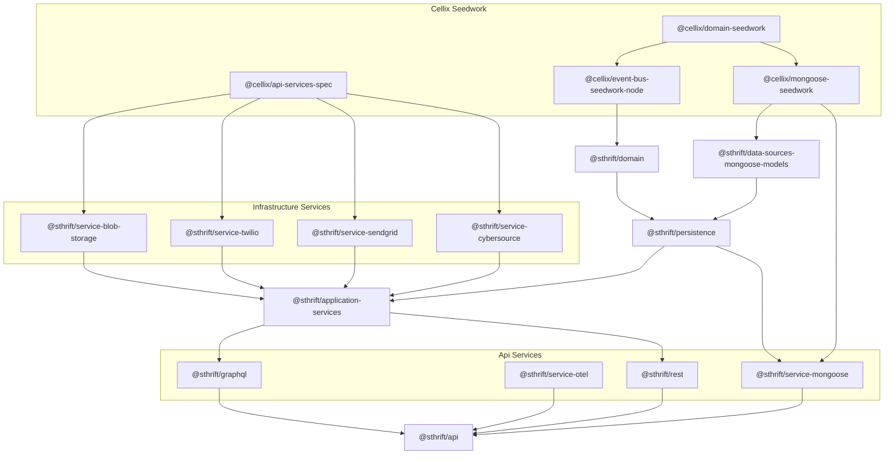

```mermaid

graph TD
  %% Seedwork and shared libraries
  subgraph Cellix Seedwork
    cellix-api-services-spec["@cellix/api-services-spec"]
    cellix-domain-seedwork["@cellix/domain-seedwork"]
    cellix-event-bus-seedwork-node["@cellix/event-bus-seedwork-node"]
    cellix-mongoose-seedwork["@cellix/mongoose-seedwork"]
  end

  %% Domain Layer
  sthrft-domain["@sthrift/domain"]
  sthrft-data-sources-mongoose-models["@sthrift/data-sources-mongoose-models"]

  %% Application Layer
  sthrft-application-services["@sthrift/application-services"]

  %% External Services (above Application Layer)
  subgraph Infrastructure Services
  sthrft-service-blob["@sthrift/service-blob-storage"]
  sthrft-service-cybersource["@sthrift/service-cybersource"]
  sthrft-service-sendgrid["@sthrift/service-sendgrid"]
  sthrft-service-twilio["@sthrift/service-twilio"]
  end

  %% Infrastructure Layer
  sthrft-persistence["@sthrift/persistence"]
  sthrft-service-blob["@sthrift/service-blob-storage"]
  sthrft-service-cybersource["@sthrift/service-cybersource"]
  sthrft-service-sendgrid["@sthrift/service-sendgrid"]
  sthrft-service-twilio["@sthrift/service-twilio"]

  %% API Layer
  subgraph Api Services
  sthrft-graphql["@sthrift/graphql"]
  sthrft-service-otel["@sthrift/service-otel"]
  sthrft-rest["@sthrift/rest"]
  sthrft-service-mongoose["@sthrift/service-mongoose"]
  end
  sthrft-api["@sthrift/api"]

  %% Connections
  cellix-domain-seedwork --> cellix-event-bus-seedwork-node
  cellix-domain-seedwork --> cellix-mongoose-seedwork
  cellix-event-bus-seedwork-node --> sthrft-domain
  cellix-mongoose-seedwork --> sthrft-data-sources-mongoose-models
  cellix-mongoose-seedwork --> sthrft-service-mongoose
  cellix-api-services-spec --> sthrft-service-blob
  cellix-api-services-spec --> sthrft-service-twilio
  cellix-api-services-spec --> sthrft-service-sendgrid
  cellix-api-services-spec --> sthrft-service-cybersource


  sthrft-domain --> sthrft-persistence

  sthrft-data-sources-mongoose-models --> sthrft-persistence

  sthrft-persistence --> sthrft-application-services
  sthrft-service-blob --> sthrft-application-services
  sthrft-service-cybersource --> sthrft-application-services
  sthrft-service-sendgrid --> sthrft-application-services
  sthrft-service-twilio --> sthrft-application-services
  sthrft-persistence --> sthrft-service-mongoose

  sthrft-application-services --> sthrft-graphql
  sthrft-application-services --> sthrft-rest

  sthrft-service-mongoose --> sthrft-api
  sthrft-service-otel --> sthrft-api

  sthrft-graphql --> sthrft-api
  sthrft-rest --> sthrft-api

  %% API entrypoint
  sthrft-api["@sthrift/api"]


```
