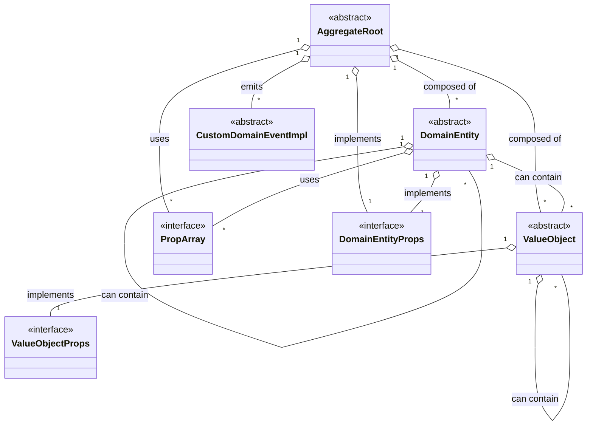

# @cellix/domain-seedwork

Foundational, framework-agnostic building blocks for Domain-Driven Design (DDD) used across the Cellix monorepo. This package provides base classes and interfaces for aggregates, entities, value objects, domain events, repositories, units of work, and simple authorization primitives. It intentionally contains no infrastructure code (no HTTP, databases, queues).

- Purpose: act as seedwork to be extended/implemented by bounded contexts (e.g., `@ocom/api-domain`).
- Scope: abstractions and minimal base implementations only; concrete persistence/event bus live in other packages.
- Language/runtime: TypeScript 5.8, ESM, Node 22+.

For detailed API of individual exports, see the README files:
    - [Domain Seedwork API docs](./src/domain-seedwork/README.md)
    - [Passport Seedwork API docs](./src/passport-seedwork/README.md)

## Install

```sh
npm i -w @cellix/domain-seedwork
# or if you only need it at compile-time
npm i -D -w @cellix/domain-seedwork
```

## Entry points

- Public API is exposed via the package root:
```ts
import { DomainSeedwork, PassportSeedwork } from '@cellix/domain-seedwork';
```
- Deep imports into `src/**` are not part of the public API and are not recommended.

## Folder structure

```
packages/cellix-domain-seedwork/
├── src/
│   ├── domain-seedwork/         # Core DDD seedwork (aggregates, entities, VO, events, repo, UoW)
│   │   ├── README.md            # API and usage for seedwork exports (authoritative)
│   │   ├── aggregate-root.ts
│   │   ├── domain-entity.ts
│   │   ├── value-object.ts
│   │   ├── domain-event.ts
│   │   ├── event-bus.ts
│   │   ├── repository.ts
│   │   ├── unit-of-work.ts
│   │   ├── type-converter.ts
│   │   ├── prop-array.ts
│   │   └── ...
│   ├── passport-seedwork/       # Minimal authorization primitives
│   │   ├── visa.ts              # Generic Visa interface
│   │   └── index.ts
│   └── index.ts                 # Root exports (DomainSeedwork, PassportSeedwork)
├── package.json
├── tsconfig.json
└── readme.md (this file)
```

## Usage overview

### DDD Relationship Diagram



- Aggregates, entities, value objects: Extend base types from `DomainSeedwork`.
- Domain events: Use `DomainEvent` or define typed events with `CustomDomainEventImpl`.
- Repositories and UoW: Implement `Repository<T>` and `UnitOfWork` in your infrastructure package, keep aggregates persistence-agnostic.
- Authorization: Define your Passport/Visas in your domain; this package only provides the `Visa<T>` contract.

For full details and examples, refer to [Domain Seedwork API docs](./src/domain-seedwork/README.md) and [Passport Seedwork API docs](./src/passport-seedwork/README.md).

## Dependencies

- Runtime dependencies: none (this package is infrastructure-free).
- Dev dependencies are used for build, lint, and test only.

## Scripts

Common scripts from `package.json` (executed in this workspace):

- Build: `npm run build -w @cellix/domain-seedwork`
- Clean: `npm run clean -w @cellix/domain-seedwork`
- Test: `npm run test:unit -w @cellix/domain-seedwork`
- Lint/Format: `npm run lint -w @cellix/domain-seedwork` / `npm run format -w @cellix/domain-seedwork`

## Notes

- No infrastructure dependencies; safe to import in any runtime.
- All public classes and interfaces are exported via `src/index.ts`.

## Audience and non-goals

- Audience: teams modeling domain logic with DDD (aggregates, entities, value objects, events).
- Non-goals: persistence/event bus implementations, framework-specific code, or any runtime side-effects.

## See also

- `@cellix/data-sources-mongoose` — Mongoose implementations for Repository/UoW/TypeConverter/PropArray
- `@ocom/api-domain` — Real-world domain using this seedwork

---

## Recipe History

npm i -D -w cellix-domain-seedwork @tsconfig/node20 @tsconfig/node-ts typescript

npm i -D -w cellix-domain-seedwork rimraf

npm i -D -w cellix-domain-seedwork eslint @eslint/js typescript-eslint
