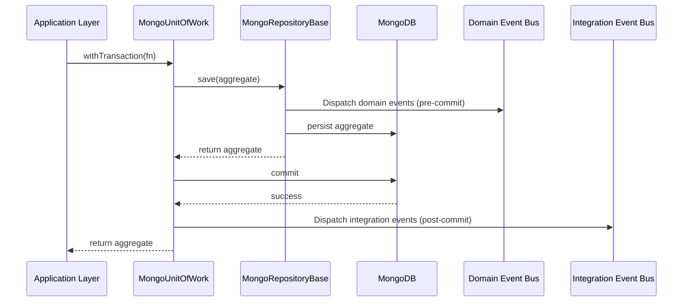

# @cellix/data-sources-mongoose

Infrastructure implementations and helpers for using MongoDB/Mongoose with Cellix domain seedwork. This package provides concrete adapters for repositories, units of work, type converters, Mongoose prop arrays, and model/connection helpers. It keeps domains persistence‑agnostic while enabling a clean, testable infrastructure layer.

- *Purpose*: provide Mongoose-based infrastructure that implements `@cellix/domain-seedwork` abstractions.
- *Scope*: repositories, unit of work, converters, model factories, adapters; no domain/business rules.
- *Prerequisites*: TypeScript 5.8, ESM, Node 22+.

For detailed persistence-side API and examples, see:
- `src/mongoose-seedwork/README.md`

## Install

```sh
npm i -w @cellix/data-sources-mongoose
# or if you only need it at compile-time
npm i -D -w @cellix/data-sources-mongoose
```

## Entry points

- Public API is exposed via the package root:
```ts
import { MongooseSeedwork } from '@cellix/data-sources-mongoose';
```
- Deep imports into `src/**` are not part of the public API and are not recommended.

## Folder structure

```
packages/cellix-data-sources-mongoose/
├── src/
│   ├── mongoose-seedwork/          # Mongoose infra seedwork (repos, uow, converters, adapters)
│   │   ├── README.md               # API and usage for exports (authoritative)
│   │   ├── mongo-connection.ts
│   │   ├── mongo-domain-adapter.ts
│   │   ├── mongo-repository.ts
│   │   ├── mongo-type-converter.ts
│   │   ├── mongo-unit-of-work.ts
│   │   ├── mongoose-prop-array.ts
│   │   └── ...
│   └── index.ts                    # Root exports (MongooseSeedwork)
├── package.json
├── tsconfig.json
└── readme.md (this file)
```

## Usage overview

### Persistence Lifecycle


- Repositories/UoW: Extend `MongoRepositoryBase`, use `MongoUnitOfWork` / `getInitializedUnitOfWork` to scope transactions and dispatch events.
- Type conversion: Implement `MongoTypeConverter` to map Mongoose docs ↔ domain aggregates via adapters.
- Prop arrays: Use `MongoosePropArray` for embedded collections on Mongoose `DocumentArray`s.
- Domain seedwork integration: Pair with `@cellix/domain-seedwork` for aggregates, entities, value objects, and events.

For full API and usage details, refer to [Mongoose Seedwork API docs](src/mongoose-seedwork/README.md).

## Dependencies

- Peer dependencies: `@cellix/domain-seedwork`, `@cellix/event-bus-seedwork-node`.
- Runtime dependencies: minimal (e.g., `@types/mongoose` typings shipped for convenience). Your app should install `mongoose`.
- Dev dependencies are used for build, lint, and test only.

## Scripts

Common scripts from `package.json` (executed in this workspace):

- Build: `npm run build -w @cellix/data-sources-mongoose`
- Clean: `npm run clean -w @cellix/data-sources-mongoose`
- Test: `npm run test:unit -w @cellix/data-sources-mongoose`
- Lint/Format: `npm run lint -w @cellix/data-sources-mongoose` / `npm run format -w @cellix/data-sources-mongoose`

## Notes

- Keep domain models free of persistence concerns; place infra code here.
- All public classes and interfaces are exported via `src/index.ts`.

## Audience and non-goals

- Audience: teams implementing infrastructure for aggregates using Mongoose.
- Non-goals: domain/business rules, GraphQL/HTTP handling.

## See also

- `@cellix/domain-seedwork` — Core DDD seedwork which contains contracts implemented by this infra seedwork
- `@sthrift/api-persistence` — Real-world example of persistence layer leveraging this infra seedwork
- `@sthrift/api-data-sources-mongoose-models` — Real-world example of Mongoose models used with this infra seedwork

---

## Recipe History

npm i -D -w cellix-data-sources-mongoose @tsconfig/node20 @tsconfig/node-ts typescript
npm i -D -w cellix-data-sources-mongoose eslint @eslint/js typescript-eslint