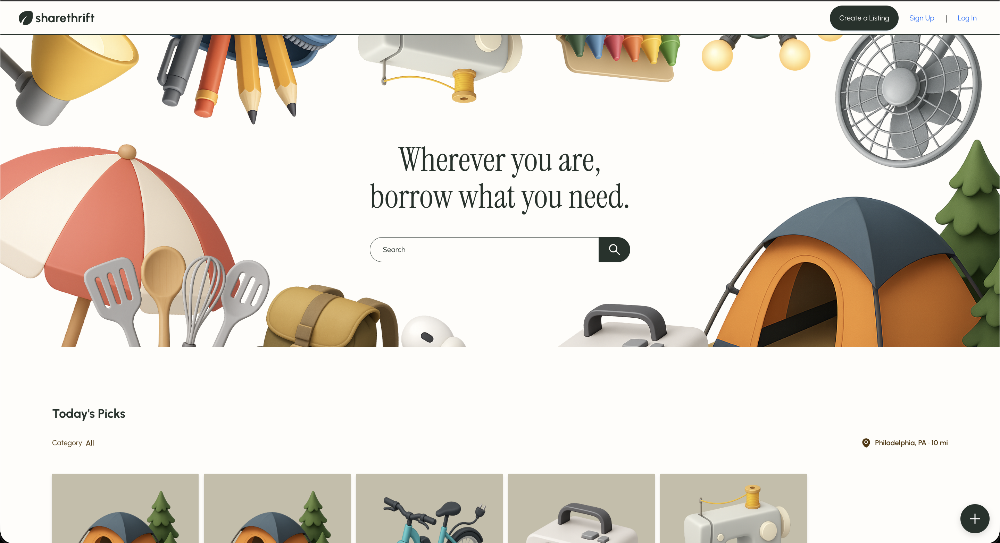

# ShareThrift

A modern, community‑driven platform designed to reduce waste and enable the sharing of items, services, and classes — empowering individuals and organizations to participate in the circular economy.


[](https://sonarcloud.io/summary/new_code?id=simnova_sharethrift-data-access)

[](https://snyk.io/test/github/sharethrift/sharethrift)

[](https://sonarcloud.io/summary/new_code?id=simnova_sharethrift-data-access)

[](https://sonarcloud.io/summary/new_code?id=simnova_sharethrift-data-access)

[](https://sonarcloud.io/summary/new_code?id=simnova_sharethrift-data-access)

[](https://sonarcloud.io/summary/new_code?id=simnova_sharethrift-data-access)

[](https://dev.azure.com/simnova/ShareThrift/_build/latest?definitionId=12&branchName=main)



## 📌 Introduction

<a href="https://developers.sharethrift.com/docs/intro">Getting Started</a>: Our Docusaurus website will help you get started in running and contributing to ShareThrift.

ShareThrift is a web‑based peer‑to‑peer sharing platform that enables people and organizations to lend, borrow, or offer items, services, and classes. Inspired by platforms like Turo, Airbnb, and Facebook Marketplace — but built specifically for the sharing economy — ShareThrift provides a structured, trusted, and community-first way to exchange goods.

### ShareThrift exists to:

- Reduce consumer waste by extending item lifecycles
- Enable cost‑efficient access to tools, equipment, and skills
- Support individuals, small businesses, and partners with flexible sharing models
- Explore modern technology and product design patterns through an MVP implementation
- This project is built using Domain-Driven Design (DDD), event-driven communication, and modular application boundaries as specified in the official BRD/SRD.

## 🗂 Table of Contents

- [Features](#-features)
- [Architecture](#-architecture)
- [Monorepo Structure](#-monorepo-structure)
- [Tech Stack](#-tech-stack)
- [Getting Started](#-getting-started)
- [Local Endpoints](#-local-endpoints)
- [Domain & DDD Conventions](#-domain--ddd-conventions)
- [Testing](#-testing)
- [Architecture Decisions (ADRs)](#-architecture-decisions-adrs)
- [Contributing](#-contributing)

## ✨ Features

### 🔍 Browse, Search & Filter Listings

- Filter by location, and category
- View active, inactive, and upcoming listings

### 🧰 Create & Manage Listings

- Support for Item, Service, and Class listings
- Draft, publish, pause, cancel, appeal, and reinstate listings
- AI‑assisted draft creation using the integrated chatbot

### 📅 Reservation Lifecycle

- Calendar‑based booking
- Accept, reject, cancel, and close reservation flows
- Email notifications for all major events

### 💬 Messaging

- In‑platform messaging between sharers and reservers
- Auto‑expiring conversation threads tied to listings

### 🛡 Admin Tools

- Listing moderation
- User blocking/unblocking
- Feature flag management
- Embedded analytics and reporting

## 🏗 Architecture

ShareThrift applies layered Domain-Driven Design:

- Domain Layer: aggregates, entities, value objects, domain events
- Application Layer: orchestration / services (future explicit service modules)
- Infrastructure Layer: persistence (Mongoose), telemetry, messaging adapters
- Interface Layer: Azure Functions entrypoints (GraphQL + planned REST)

Key patterns:

- Aggregates coordinate consistency boundaries
- Value Objects enforce immutability and constraints
- Unit of Work plans for atomic change sets
- Event-driven strategy (domain + integration events) evolving via ADRs
- Service Registry (Cellix.initializeServices) for dependency injection

## 🧬 Monorepo Structure

```
apps/
  api/            # Azure Functions host (GraphQL + future REST)
  docs/           # Docusaurus docs site
  ui-sharethrift/ # Front-end (Vite + TypeScript)
packages/
  sthrift/        # Domain + adapters (graphql, mongoose, etc.)
  cellix/         # Seedwork abstractions
iac/              # Bicep infrastructure modules
documents/        # BRD, SRD, ADRs, architecture diagrams
```

## 🛠 Tech Stack

- Runtime: Node.js 22.12.0 / Azure Functions v4
- Package Manager: pnpm
- Language: TypeScript (strict config)
- API: Apollo GraphQL
- Persistence: MongoDB (Mongoose); Cosmos MongoDB target in cloud
- Infra as Code: Bicep modules (iac)
- Tooling: Turborepo, Vitest, Biome, SonarQube, Sourcery
- Local Azure Emulation: Azurite (blob/queue)
- Observability: OpenTelemetry + Azure Monitor integration
- Quality Gates: Sonar + coverage thresholds per package

## 🚀 Getting Started

Prerequisites

- Node.js v22.12.0 (use nvm)
- Azurite

Install & Build

```
nvm use v22
pnpm install
pnpm run build
```

  
  

Run (Dev)

```
pnpm run dev
```


## 🔗 Local Endpoints

| Portal   | Endpoint                          |
| -------- | --------------------------------- |
| Frontend | http://localhost:3000             |
| Doc      | http://localhost:3002             |
| Graphql  | http://localhost:7071/api/graphql |

## 🧩 Domain & DDD Conventions

- Bounded contexts under [packages/sthrift/domain/src/domain/contexts/](./packages/sthrift/domain/src/domain/contexts/)\*
- Each context exposes a clear ubiquitous language via exports
- Passports/Visas enforce permission checks at aggregate boundaries
- Value Objects: pure data + validation (no side effects)
- Aggregates: guard invariants, emit domain events (future integration bus)
- Repositories: interfaces only in domain; adapters reside outside
- Unit of Work: orchestrates aggregate persistence + event publication plans

## 🧪 Testing

```
pnpm run test
```


Guidelines:

- Every aggregate, entity, and value object requires coverage
- Use descriptive test names expressing business rules
- Feature files (\*.feature) for higher-level domain scenario documentation

## 🧾 Architecture Decisions (ADRs)

Located in [apps/docs/docs](/apps/docs/docs)

- 0001-madr-architecture-decisions.md
- adr-short-template.md
- adr-template.md
- 0022-existing-azure-upload.md

Add a new ADR for any significant platform, pattern, or model/idea change (e.g., Azure Upload - Enhancement).

## 🤝 Contributing

1. Fork / branch from main (e.g., feature/listing-lifecycle)
2. Implement domain changes first (aggregate, permissions)
3. Add tests & update docs
4. Run: `pnpm run build` and `pnpm run test`
5. Submit PR referencing ADRs if relevant

Coding Guidelines:

- Explicit domain terminology > generic names
- Keep functions small & intention-revealing
- Avoid leaking infrastructure concerns into domain layer
