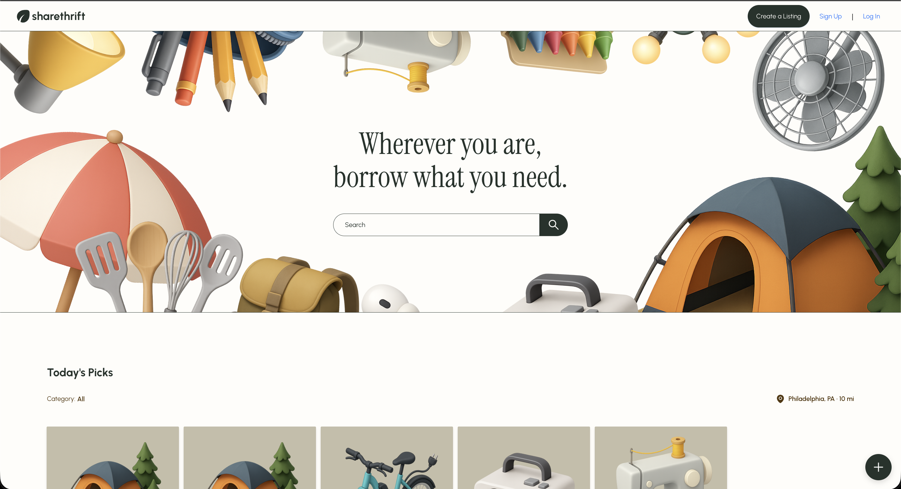
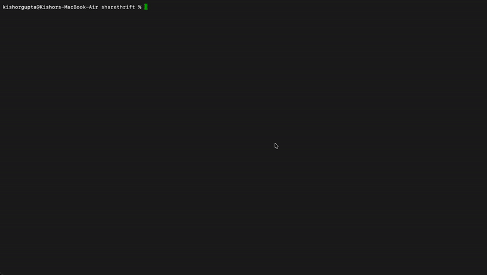

# ShareThrift

A modern, community‑driven platform designed to reduce waste and enable the sharing of items, services, and classes — empowering individuals and organizations to participate in the circular economy.


[](https://sonarcloud.io/summary/new_code?id=simnova_sharethrift-data-access)

[](https://snyk.io/test/github/sharethrift/sharethrift)

[](https://sonarcloud.io/summary/new_code?id=simnova_sharethrift-data-access)

[](https://sonarcloud.io/summary/new_code?id=simnova_sharethrift-data-access)

[](https://sonarcloud.io/summary/new_code?id=simnova_sharethrift-data-access)

[](https://sonarcloud.io/summary/new_code?id=simnova_sharethrift-data-access)

[](https://dev.azure.com/simnova/ShareThrift/_build/latest?definitionId=12&branchName=main)



## 📌 Introduction

<a href="https://developers.sharethrift.com/docs/intro">Getting Started</a>: Our Docusaurus website will help you get started in running and contributing to ShareThrift.

Note: SonarCloud badges reference the `simnova_sharethrift-data-access` project configured in `sonar-project.properties` for monorepo analysis.

ShareThrift is a web‑based peer‑to‑peer sharing platform that enables people and organizations to lend, borrow, or offer items, services, and classes. Inspired by platforms like Turo, Airbnb, and Facebook Marketplace — but built specifically for the sharing economy — ShareThrift provides a structured, trusted, and community-first way to exchange goods.

### ShareThrift exists to:

- Reduce consumer waste by extending item lifecycles
- Enable cost‑efficient access to tools, equipment, and skills
- Support individuals, small businesses, and partners with flexible sharing models
- Explore modern technology and product design patterns through an MVP implementation
- This project is built using Domain-Driven Design (DDD), event-driven communication, and modular application boundaries as specified in the official BRD/SRD.

## 🗂 Table of Contents

- [Features](#-features)
- [Architecture](#-architecture)
- [Monorepo Structure](#-monorepo-structure)
- [Tech Stack](#-tech-stack)
- [Getting Started](#-getting-started)
- [Local Endpoints](#-local-endpoints)
- [Domain & DDD Conventions](#-domain--ddd-conventions)
- [Testing](#-testing)
- [Architecture Decisions (ADRs)](#-architecture-decisions-adrs)
- [Contributing](#-contributing)

## ✨ Features

### 🔍 Browse, Search & Filter Listings

- Filter by location and category
- View active, inactive, and upcoming listings

### 🧰 Create & Manage Listings

- Support for Item, Service, and Class listings
- Draft, publish, pause, cancel, appeal, and reinstate listings
- AI‑assisted draft creation using the integrated chatbot

### 📅 Reservation Lifecycle

- Calendar‑based booking
- Accept, reject, cancel, and close reservation flows
- Email notifications for all major events

### 💬 Messaging

- In‑platform messaging between sharers and reservers

### 🛡 Admin Tools

- Listing moderation
- User blocking/unblocking
- Feature flag management
- Embedded analytics and reporting

## 🏗 Architecture

ShareThrift is implemented using Domain-Driven Design (DDD), event-driven behaviors, and clear modular boundaries defined in the BRD/SRD. These principles ensure predictable evolution, maintainability, and clear separation of concerns across the platform.

ShareThrift applies layered Domain-Driven Design:

- Domain Layer: aggregates, entities, value objects, domain events (see [Domain & DDD Concepts](https://developers.sharethrift.com/docs/technical-overview/translate-your-site))
- Application Layer: orchestration / services (future explicit service modules)
- Infrastructure Layer: persistence (Mongoose), telemetry, messaging adapters
- Interface Layer: Azure Functions entrypoints (GraphQL + planned REST)

Key patterns:

- Aggregates coordinate consistency boundaries
- Value Objects enforce immutability and constraints
- Unit of Work plans for atomic change sets
- Event-driven strategy (domain + integration events) evolving via ADRs
- Service Registry (Cellix.initializeServices) for dependency injection

## 🧬 Monorepo Structure

```
apps/
  api/            # Azure Functions host (GraphQL + future REST)
  docs/           # Docusaurus docs site
  ui-sharethrift/ # Front-end (Vite + TypeScript)
packages/
  sthrift/        # Domain + adapters (graphql, mongoose, etc.)
  cellix/         # Seedwork abstractions
iac/              # Bicep infrastructure modules
documents/        # BRD, SRD, ADRs, architecture diagrams
```

## 🛠 Tech Stack

- Runtime: Node.js (v22 per `mise.toml`) / Azure Functions ([see package.json](./apps/api/package.json))
- Version Manager: [mise](https://mise.jdx.dev/) (manages Node.js + Python)
- Package Manager: pnpm ([see package.json](./package.json))
- Language: TypeScript (strict config) ([see package.json](./package.json))
- API: Apollo GraphQL ([see package.json](./packages/sthrift/graphql/package.json))
- Persistence: MongoDB (Mongoose)([see package.json](./packages/sthrift/service-mongoose/package.json)); Cosmos MongoDB target in cloud
- Infra as Code: Bicep modules (iac)
- Tooling: Turborepo ([see package.json](./package.json)), Vitest ([see package.json](./package.json)), Biome ([see package.json](./package.json)), SonarQube ([see package.json](./package.json)), Sourcery
- Local Azure Emulation: Azurite (blob/queue) ([see package.json](./package.json))
- Observability: OpenTelemetry + Azure Monitor integration
- Quality Gates: Sonar + Sourcery + coverage thresholds per package

## 🚀 Getting Started

### 🧩 Prerequisites

**1. Install mise** (version manager for Node.js + Python)
```bash
# macOS with Homebrew
brew install mise

# Other systems: https://mise.jdx.dev/getting-started.html
```

**2. Activate mise in your shell**
```bash
# Add this to ~/.zshrc or ~/.bashrc (one-time setup)
eval "$(mise activate zsh)"  # or bash/fish

# Then reload: source ~/.zshrc
```

**2.1 Trouble Shooting
May need to run 

```bash
mise trust
```
if it says it does not have permission.

**3. Install tools & dependencies**
```bash
mise install  # Installs Node.js + Python per mise.toml + requirements.txt
```

This automatically:
- Installs Node.js v22.20.0 (from `mise.toml`)
- Installs Python 3.13 (from `mise.toml`)
- Creates `.venv/` Python virtual environment
- Installs Python packages from `requirements.txt` (Sourcery for code review)

### 🏗️ Install & Build


May need to run 

```bash 
pnpm setup
```

```bash
# Install Node and Python dependencies
pnpm run install:all

# Build the project
pnpm run build
```

Or install separately:
```bash
pnpm install
pip install -r requirements.txt
pnpm run build
```




### 🛠️ Run (Dev)

```
pnpm run dev
```

If a popup appears for network security after running dev, enter your password and approve.


## 🔗 Local Endpoints

| Portal   | Endpoint                           |
| -------- | ---------------------------------- |
| Frontend | http://localhost:3000              |
| Docs     | http://localhost:3002              |
| GraphQL  | http://localhost:7071/api/graphql  |

## 🧩 Domain & DDD Conventions

This repo follows strict DDD boundaries (contexts, aggregates, value objects, repositories, UoW, and permissions via passports/visas). See full conventions, file naming, and reviewer checks in CONTRIBUTING.

- Full guidance: see [CONTRIBUTING → Domain & DDD Conventions](./CONTRIBUTING.md#domain--ddd-conventions)
- Naming and layout: see [CONTRIBUTING → Naming & File Conventions](./CONTRIBUTING.md#naming--file-conventions)

## 🧪 Testing & Code Review

**Unit & Integration Tests**
```bash
pnpm run test              # Run all tests
pnpm run test:watch       # Watch mode
pnpm run test:all         # Full suite with coverage
```


**Code Review with Sourcery**
```bash
sourcery login            # One-time setup (https://sourcery.ai)
pnpm run sourcery:review  # Review changed files
pnpm run sourcery:review:diff  # Review only diff vs main
```

Full guidance: see [CONTRIBUTING → Testing & Quality Requirements](./CONTRIBUTING.md#testing--quality-requirements)

## 🧾 Architecture Decisions (ADRs)

Located in [apps/docs/docs/decisions](/apps/docs/docs/decisions)

- 0001-madr-architecture-decisions.md
- adr-short-template.md
- adr-template.md
- 0022-existing-azure-upload.md

Add a new ADR for any significant platform, pattern, or model/idea change (e.g., Azure Upload - Enhancement).

## 🤝 Contributing

1. Fork / branch from main (e.g., feature/listing-lifecycle)
2. Implement domain changes first (aggregate, permissions)
3. Add tests & update docs
4. Run: `pnpm run build` and `pnpm run test`
5. Submit PR referencing ADRs if relevant

Coding Guidelines:

- Explicit domain terminology > generic names
- Keep functions small & intention-revealing
- Avoid leaking infrastructure concerns into domain layer
